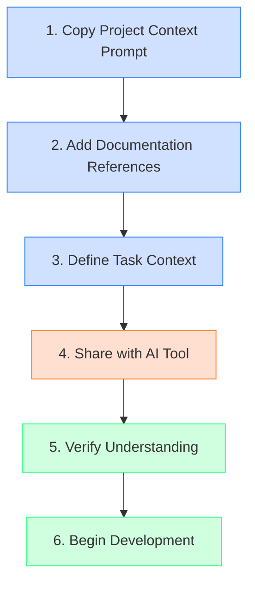

# vaahai
Agentic Coding, Review, Audit and Generation

## Overview

Vaahai is an AI-augmented code review CLI tool that combines static analysis with LLM capabilities to provide comprehensive code reviews, suggestions, and automated fixes.

## Project Structure

The project is organized into several key directories:

### `/ai_docs`

Contains AI-specific documentation formatted for AI tools to better understand the codebase. This documentation is more detailed and structured specifically to help AI systems comprehend the architecture, design patterns, and business logic.

```bash
# View AI documentation with Docsify
npm install -g docsify-cli
docsify serve ai_docs
# Access at http://localhost:3000
```

### `/docs`

Contains user-facing documentation, guides, and tutorials for human readers. This includes installation instructions, usage examples, and API documentation.

```bash
# View user documentation with Docsify
docsify serve docs
# Access at http://localhost:3001
```

### `/specs`

Contains technical specifications, requirements documents, and design proposals for the project. These documents outline the planned functionality and implementation details.

```bash
# View specifications with Docsify
docsify serve specs
# Access at http://localhost:3002
```

### `/.claude`

Contains configuration files and prompts for Claude AI integration, including specialized commands and templates for AI-assisted code review.

```bash
# Directory structure
.claude/
└── commands/
    ├── code_review.prompt        # General code review template
    ├── fix_suggestion.prompt     # Fix generation template
    ├── performance_optimization.prompt  # Performance-focused review
    └── security_audit.prompt     # Security-focused review
```

#### Using Claude Commands

The `.claude/commands` directory contains prompt templates that can be used with Claude or other LLM assistants to perform specific code analysis tasks:

1. **Code Review** (`code_review.prompt`):
   - Provides comprehensive code reviews with strengths and issues
   - Categorizes issues by severity (Critical, Important, Minor)
   - References specific line numbers and provides solutions

   ```bash
   # Example usage with Claude CLI (if available)
   claude prompt .claude/commands/code_review.prompt \
     --var language=python \
     --var code="$(cat path/to/file.py)" \
     --var static_analysis_results="$(vaahai analyze path/to/file.py)" \
     --var project_context="This is a data processing module"
   ```

2. **Fix Suggestion** (`fix_suggestion.prompt`):
   - Generates specific code fixes for identified issues
   - Provides before/after code examples
   - Explains the rationale behind fixes

3. **Performance Optimization** (`performance_optimization.prompt`):
   - Focuses on performance bottlenecks and optimization opportunities
   - Provides algorithmic improvements and resource usage recommendations
   - Includes complexity analysis

4. **Security Audit** (`security_audit.prompt`):
   - Identifies security vulnerabilities and risks
   - Provides secure coding recommendations
   - References security best practices and standards

#### Using with Different AI Assistants

These prompt templates are designed to work with various AI assistants:

##### Windsurf (Cascade)

1. **Direct Upload**:
   - Open the Cascade interface
   - Click "Upload File" or drag and drop the prompt file
   - Replace variables manually or use the `/file` command:
   ```
   /file .claude/commands/code_review.prompt
   
   Now review this Python code:
   ```python
   def example():
       pass
   ```
   Static analysis results: No issues found
   Project context: Authentication module
   ```

2. **Copy-Paste Method**:
   - Open the prompt file in your editor
   - Copy the contents
   - Paste into Cascade
   - Replace the variables with your specific content

##### GitHub Copilot

1. **Using Copilot Chat**:
   - Open the prompt file in VS Code
   - Select the content and copy it
   - In Copilot Chat, paste the prompt
   - Replace the variables with your specific content
   - Send the message

2. **Inline Code Comments**:
   - Add key parts of the prompt as comments in your code
   - For example:
   ```python
   # Perform a security audit on this function following these guidelines:
   # - Identify security vulnerabilities and risks
   # - Provide secure coding recommendations
   # - Reference security best practices
   def authenticate_user(username, password):
       # Implementation
   ```

##### OpenAI ChatGPT

1. **Direct Usage**:
   - Open ChatGPT
   - Copy the contents of the prompt file
   - Paste into the chat
   - Replace variables with your specific content

2. **Using the API**:
   ```python
   import openai
   import os
   
   # Read the prompt template
   with open('.claude/commands/code_review.prompt', 'r') as file:
       prompt_template = file.read()
   
   # Read the code to review
   with open('path/to/file.py', 'r') as file:
       code = file.read()
   
   # Replace variables
   prompt = prompt_template.replace('{language}', 'python')
   prompt = prompt.replace('{code}', code)
   prompt = prompt.replace('{static_analysis_results}', 'No issues found')
   prompt = prompt.replace('{project_context}', 'Authentication module')
   
   # Call the API
   response = openai.ChatCompletion.create(
       model="gpt-4",
       messages=[{"role": "user", "content": prompt}]
   )
   
   print(response.choices[0].message.content)
   ```

##### Anthropic Claude API

```python
import anthropic

# Read the prompt template
with open('.claude/commands/code_review.prompt', 'r') as file:
    prompt_template = file.read()

# Read the code to review
with open('path/to/file.py', 'r') as file:
    code = file.read()

# Replace variables
prompt = prompt_template.replace('{language}', 'python')
prompt = prompt.replace('{code}', code)
prompt = prompt.replace('{static_analysis_results}', 'No issues found')
prompt = prompt.replace('{project_context}', 'Authentication module')

# Call the API
client = anthropic.Anthropic(api_key="your_api_key")
message = client.messages.create(
    model="claude-3-opus-20240229",
    max_tokens=4000,
    messages=[{"role": "user", "content": prompt}]
)

print(message.content)
```

#### Customizing Prompts

You can customize these prompt templates for your specific needs:

1. Modify the existing templates to adjust the focus or output format
2. Create new templates for specialized review types
3. Add project-specific context or requirements

Variables in the prompts (enclosed in `{variable_name}`) are replaced with actual values when the prompt is used, allowing for dynamic content insertion.

## AI Context for Contributors

Before contributing code to Vaahai, it's essential to provide comprehensive context to AI coding assistants like Windsurf (Cascade), GitHub Copilot, or Junie. This ensures that AI-generated code aligns with the project's architecture, standards, and vision.

### Providing Context to AI Tools

Follow these steps to give AI tools full context of the project:

1. **Review Documentation Structure**:
   - Start by exploring the three documentation directories:
     - `/ai_docs`: AI-specific technical documentation
     - `/docs`: User-facing documentation
     - `/specs`: Technical specifications and requirements

2. **Run Documentation Servers**:
   For the best experience, run all three documentation servers simultaneously:
   ```bash
   # Terminal 1
   docsify serve ai_docs -p 3000
   
   # Terminal 2
   docsify serve docs -p 3001
   
   # Terminal 3
   docsify serve specs -p 3002
   ```

3. **Essential Documents for AI Context**:
   Before asking an AI to generate code, ensure it has reviewed these key documents:
   
   - **Project Overview**:
     - `/specs/overview/product_vision.md`: Core product vision and goals
     - `/README.md`: Project structure and basic usage
   
   - **Technical Architecture**:
     - `/specs/technical/architecture.md`: Detailed component architecture
     - `/specs/technical/api_specification.md`: API contracts and interfaces
     - `/ai_docs/ARCHITECTURE.md`: AI-focused architecture explanation
   
   - **Implementation Details**:
     - `/specs/implementation/implementation_plan.md`: Development phases and approach
     - `/specs/features/README.md`: Feature specifications
     - `/ai_docs/DESIGN_PATTERNS.md`: Design patterns used in the project
   
   - **User Stories and Requirements**:
     - `/specs/user_stories/detailed_stories.md`: Detailed user stories
     - `/specs/non_functional/requirements.md`: Non-functional requirements

4. **Providing Context to AI**:
   
   #### For Windsurf (Cascade):
   - Upload or reference the key documents above
   - Use the command: "Please review these documents to understand the Vaahai project before we start coding"
   - Share the repository structure using the `/list` command
   
   #### For GitHub Copilot:
   - Open key files in your editor so Copilot can index them
   - Add comments referencing important architectural decisions
   - Use Copilot Chat to discuss project context before generating code
   
   #### For Junie:
   - Share repository links or upload key documents
   - Provide a summary of the project architecture and goals
   - Reference specific documentation sections for detailed context

5. **Verify Understanding**:
   Before proceeding with code generation, verify the AI's understanding by asking it to:
   - Summarize the project architecture
   - Explain how the component you're working on fits into the larger system
   - Describe the data flow and key interfaces

## Project Context Prompt for AI Tools

To ensure AI assistants have a complete understanding of the Vaahai project before contributing code, we've created a specialized prompt template in `.claude/commands/project_context.prompt`. This prompt guides AI tools through the project documentation and helps them build a comprehensive mental model of the architecture, components, and design principles.

### Quick Start Guide



#### Step 1: Copy the Project Context Prompt
Locate `.claude/commands/project_context.prompt` in the repository.

#### Step 2: Add Documentation References
Include links or summaries of key documentation files:
- Product vision
- Technical architecture
- API specifications
- User stories

#### Step 3: Define Your Task Context
Briefly describe what you're working on:
- Component name
- Relevant user stories
- Specific requirements

#### Step 4: Share with Your AI Tool
Use one of the tool-specific methods below.

#### Step 5: Verify Understanding
Ask the AI to summarize its understanding before proceeding.

### Tool-Specific Integration Methods

<table>
<tr>
  <th width="20%">AI Tool</th>
  <th width="40%">Method</th>
  <th width="40%">Example</th>
</tr>
<tr>
  <td rowspan="3"><strong>Windsurf<br>(Cascade)</strong></td>
  <td><strong>Direct Prompt</strong><br>Copy prompt content directly into chat</td>
  <td>
  
  ```
  I'd like you to understand the Vaahai project before we start coding. Here's the project context:
  
  [Paste prompt content]
  
  Documentation References:
  - Architecture: [summary]
  - API Spec: [summary]
  
  Task: Implement the CodeScanner component
  ```
  </td>
</tr>
<tr>
  <td><strong>File Upload</strong><br>Upload prompt file + provide references</td>
  <td>
  
  ```
  I've uploaded the Vaahai project context prompt.
  
  Documentation References:
  - [List key docs]
  
  Task: Implement error handling for LLM Provider
  ```
  </td>
</tr>
<tr>
  <td><strong>Repository Exploration</strong><br>Guide AI through repo structure</td>
  <td>
  
  ```
  Let's explore the Vaahai project structure first:
  
  1. First, review .claude/commands/project_context.prompt
  2. Then examine these key files: [list files]
  3. Now let's implement the configuration manager
  ```
  </td>
</tr>
<tr>
  <td rowspan="3"><strong>GitHub<br>Copilot</strong></td>
  <td><strong>Copilot Chat</strong><br>Paste prompt in chat panel</td>
  <td>
  
  ```
  Before we start coding, I need you to understand the Vaahai project:
  
  [Paste prompt content]
  
  Now help me implement the static analyzer integration
  ```
  </td>
</tr>
<tr>
  <td><strong>File Context</strong><br>Open key files + use chat</td>
  <td>
  
  ```
  I've opened several key documentation files. Please review them along with this context:
  
  [Paste prompt content]
  
  Let's implement the output formatter component
  ```
  </td>
</tr>
<tr>
  <td><strong>Comment Injection</strong><br>Add context as file comments</td>
  <td>
  
  ```python
  """
  # Vaahai Project Context
  
  [Key sections from prompt]
  
  # Current Task: Implement CLI argument parsing
  """
  
  import typer
  # Your code follows
  ```
  </td>
</tr>
<tr>
  <td rowspan="2"><strong>Junie</strong></td>
  <td><strong>Direct Method</strong><br>Share prompt content directly</td>
  <td>
  
  ```
  I'm working on the Vaahai project. Here's the context:
  
  [Paste prompt content]
  
  Help me implement the agent orchestrator
  ```
  </td>
</tr>
<tr>
  <td><strong>Repository Link</strong><br>Share repo + direct to prompt</td>
  <td>
  
  ```
  I've shared my Vaahai repository. Please:
  
  1. First review .claude/commands/project_context.prompt
  2. Then check these files: [list files]
  3. Help me implement the interactive fix component
  ```
  </td>
</tr>
</table>

### Real-World Examples

#### Example 1: Implementing the Code Scanner Component

<details>
<summary><strong>Click to expand example</strong></summary>

```
I'd like you to understand the Vaahai project before we start coding. Please review this project context:

[Contents of .claude/commands/project_context.prompt]

Documentation References:
- Architecture: The system uses a modular design with CLI, Configuration Manager, Code Scanner, Static Analysis Integration, Agent Orchestration, Output Formatting, and LLM Provider components.
- API Specification: The CodeScanner interface requires methods for scan_file(), scan_directory(), and get_file_metadata().
- User Stories: US-02 requires directory scanning with configurable inclusion/exclusion patterns.

Task Context:
I'm implementing the CodeScanner component that identifies and processes code files for review. It needs to handle file paths, directory paths, and glob patterns, filter files based on inclusion/exclusion rules, and extract file metadata.

Can you summarize your understanding of how the CodeScanner fits into the overall architecture before we begin implementation?
```
</details>

#### Example 2: Implementing the LLM Provider Interface

<details>
<summary><strong>Click to expand example</strong></summary>

```
I've uploaded the Vaahai project context prompt. Please use it with the following information:

Documentation References:
- API Specification: The LLMProvider interface requires methods for initialize(), generate_completion(), and handle_errors().
- Non-functional Requirements: The system must support both cloud-based and local LLM providers, with appropriate error handling for network issues and rate limiting.
- User Stories: US-05 requires the ability to switch between different LLM providers.

Task Context:
I'm implementing the LLMProvider interface and concrete implementations for OpenAI and Ollama. The interface needs to handle authentication, prompt formatting, response parsing, and error handling consistently across different providers.

Before we start coding, can you explain how the LLMProvider component interacts with the Agent Orchestration component?
```
</details>

### Verification Checklist

Before proceeding with code generation, verify the AI's understanding by asking:

- [ ] Can you summarize the Vaahai project architecture?
- [ ] How does the component we're working on fit into the overall system?
- [ ] What are the key interfaces and data flows for this component?
- [ ] What design patterns should we follow for this implementation?
- [ ] How should we handle error cases for this component?

### Cross-Session Context Maintenance

For long-term projects spanning multiple sessions:

1. **End-of-Session Summary**: Ask the AI to summarize what was accomplished and the current state
2. **Context Refreshing**: Begin new sessions by providing the previous summary along with the project context prompt
3. **Focused Documentation**: Reference only the documentation sections relevant to the current task

By using this structured approach to providing project context, you'll ensure that AI-generated code aligns with Vaahai's architecture, follows established patterns, and meets the project's requirements.

## Documentation

This project includes detailed AI-specific documentation in the `/ai_docs` directory, designed to provide comprehensive information about the architecture, APIs, design patterns, and implementation details.

### Viewing Documentation with Docsify

The documentation can be viewed in a browser using Docsify, a lightweight documentation site generator.

#### Setup Instructions

1. Install Docsify CLI globally:
   ```bash
   npm install -g docsify-cli
   ```

2. Start the Docsify server for any documentation directory:
   ```bash
   # For AI documentation
   docsify serve ai_docs -p 3000
   
   # For user documentation
   docsify serve docs -p 3001
   
   # For specifications
   docsify serve specs -p 3002
   ```

3. Access the documentation in your browser:
   ```
   AI docs: http://localhost:3000
   User docs: http://localhost:3001
   Specs: http://localhost:3002
   ```

#### Documentation Features

- **Interactive Navigation**: Use the sidebar to navigate between different documentation files
- **Search Functionality**: Search across all documentation
- **Code Highlighting**: Proper syntax highlighting for code examples
- **Responsive Design**: Works on desktop and mobile devices

### Available Documentation

- **AI_CONTEXT.md**: Overview of the project with context for AI tools
- **ARCHITECTURE.md**: Detailed architectural overview
- **API_REFERENCE.md**: Comprehensive API documentation
- **DESIGN_PATTERNS.md**: Documentation of key design patterns
- **BUSINESS_LOGIC.md**: Description of core business logic and rules
- **TESTING_STRATEGY.md**: Overview of testing philosophy and practices
- **IMPLEMENTATION_ROADMAP.md**: Detailed development roadmap
- **AI_INTEGRATION.md**: Specific details about LLM integration

For more information about documentation setup options, see `/ai_docs/DOCUMENTATION_SERVER.md`.

## Best Practices for AI-Assisted Development

1. **Start with Specifications**:
   - Always begin with user stories and specifications before writing code
   - Reference the appropriate specification documents when requesting code

2. **Follow the Architecture**:
   - Ensure generated code follows the defined architecture
   - Verify component boundaries and interfaces match the specifications

3. **Maintain Consistency**:
   - Check that generated code follows project coding standards
   - Ensure naming conventions align with existing documentation

4. **Iterative Refinement**:
   - Use AI tools to generate initial implementations, then refine
   - Validate generated code against acceptance criteria from user stories

By providing comprehensive context to AI tools before contributing code, you'll ensure that AI-generated contributions align with the project's vision, architecture, and standards, resulting in higher quality and more consistent code.
