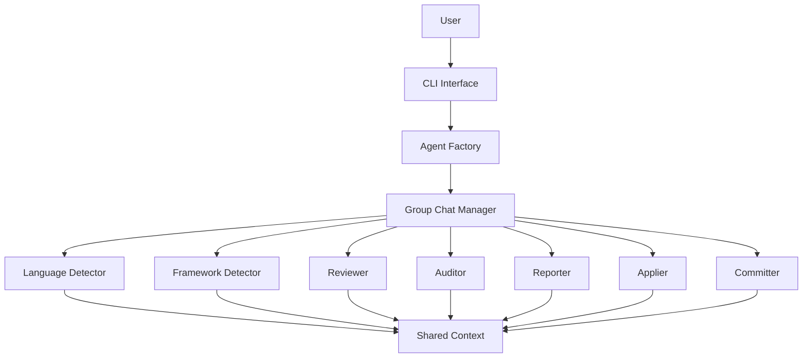

# VaahAI Agent Architecture

This document details the multi-agent architecture of VaahAI, explaining how different AI agents collaborate to perform complex tasks using Microsoft's Autogen Framework.

## Agent System Overview

VaahAI implements a multi-agent system where specialized agents work together to analyze code, provide feedback, and implement changes. The system leverages Microsoft's Autogen Framework for agent orchestration and collaboration.

## Agent Types and Responsibilities

### 1. Language Detector Agent

**Purpose**: Identify programming languages used in the codebase.

**Responsibilities**:
- Analyze file extensions and content patterns
- Detect multiple languages in a project
- Determine primary and secondary languages
- Provide language statistics and distribution
- Identify language versions when possible

**Inputs**:
- File paths or directory structure
- File contents for analysis
- Configuration preferences

**Outputs**:
- JSON structure with detected languages
- Confidence scores for detections
- File-to-language mappings
- Language statistics

### 2. Framework Detector Agent

**Purpose**: Identify frameworks, libraries, and technologies used in the codebase.

**Responsibilities**:
- Analyze import statements and dependencies
- Detect configuration files and patterns
- Identify project structure conventions
- Determine technology stack components
- Recognize build systems and tooling

**Inputs**:
- File contents and structure
- Language detection results
- Dependency files (package.json, requirements.txt, etc.)

**Outputs**:
- JSON structure with detected frameworks
- Confidence scores for detections
- Framework versions when available
- Technology stack summary

### 3. Reviewer Agent

**Purpose**: Perform code reviews focusing on quality, style, and best practices.

**Responsibilities**:
- Identify code quality issues
- Check for style consistency
- Detect potential bugs and edge cases
- Suggest improvements and refactorings
- Provide educational feedback

**Inputs**:
- Code content to review
- Language and framework context
- Review depth and focus preferences
- Static analysis results (optional)

**Outputs**:
- Structured review findings
- Severity-prioritized issues
- Specific improvement suggestions
- Code examples for fixes

### 4. Auditor Agent

**Purpose**: Perform comprehensive code audits for security, compliance, and architecture.

**Responsibilities**:
- Identify security vulnerabilities
- Check compliance with standards
- Assess architectural patterns
- Evaluate performance concerns
- Analyze maintainability and scalability

**Inputs**:
- Codebase or module to audit
- Language and framework context
- Compliance standards to check
- Audit depth and focus preferences

**Outputs**:
- Structured audit findings
- Risk-prioritized issues
- Compliance gap analysis
- Remediation recommendations

### 5. Reporter Agent

**Purpose**: Format and present findings from reviews and audits.

**Responsibilities**:
- Organize findings by severity and category
- Generate formatted reports
- Prioritize and summarize key issues
- Create visual representations
- Adapt output to requested format

**Inputs**:
- Review or audit findings
- Output format preference
- Customization options
- Verbosity level

**Outputs**:
- Formatted report in requested format
- Summary statistics and highlights
- Actionable recommendations
- Visual elements when appropriate

### 6. Applier Agent

**Purpose**: Apply suggested code changes safely.

**Responsibilities**:
- Parse change suggestions
- Create file backups
- Apply changes with user confirmation
- Handle conflicts and errors
- Verify changes maintain code integrity

**Inputs**:
- Original code files
- Suggested changes
- User preferences for application
- Confirmation for each change

**Outputs**:
- Modified code files
- Change application report
- Backup file locations
- Conflict notifications

### 7. Committer Agent

**Purpose**: Manage git commits for applied changes.

**Responsibilities**:
- Generate meaningful commit messages
- Stage changed files
- Create commits
- Handle branch management
- Prepare pull requests

**Inputs**:
- Modified files
- Change context and purpose
- User preferences for commits
- Branch information

**Outputs**:
- Git commits
- Commit messages
- Branch updates
- Pull request descriptions

## Agent Collaboration Model

VaahAI uses Autogen's GroupChat to enable agent collaboration. The collaboration follows these patterns:

### Sequential Processing

For tasks that follow a clear sequence, agents are activated in order:

1. Language Detector → Framework Detector → Reviewer/Auditor → Reporter

### Parallel Processing

For independent subtasks, multiple agents can work simultaneously:

1. Language Detector and Framework Detector can work in parallel
2. Multiple Reviewer agents can analyze different files concurrently

### Consensus Building

For complex decisions, multiple agents can contribute perspectives:

1. Reviewer and Auditor might both analyze security concerns
2. Multiple specialized Reviewer agents might evaluate different aspects of the same code

### Hierarchical Delegation

For complex tasks, a coordinator agent can delegate subtasks:

1. A main Reviewer agent might delegate specialized reviews to domain experts
2. An Auditor might delegate specific compliance checks to specialized agents

## Agent Communication

Agents communicate through Autogen's messaging system with these characteristics:

1. **Structured Messages**: JSON-formatted data for machine processing
2. **Context Sharing**: Common context accessible to all agents
3. **Request-Response**: Clear request and response patterns
4. **Conversation History**: Access to previous messages for context
5. **Termination Conditions**: Clear criteria for task completion

## Agent Configuration

Each agent can be configured through:

1. **Global Settings**: Applied to all agents
2. **Agent-Specific Settings**: Customizations for individual agents
3. **Task-Specific Settings**: Parameters for specific tasks
4. **User Preferences**: User-defined behavior modifications

## Agent Extensibility

The agent architecture supports extensibility through:

1. **Custom Agents**: New agent types can be added
2. **Custom Prompts**: Agent prompts can be modified
3. **Plugin System**: Functionality can be extended with plugins
4. **Tool Integration**: Agents can leverage external tools

## Agent Implementation

Each agent is implemented with:

1. **Base Class**: Common functionality and interfaces
2. **Prompt Templates**: LLM instructions for the agent's role
3. **Specialized Logic**: Role-specific processing
4. **Configuration Schema**: Customizable parameters
5. **Output Formatters**: Standardized output handling

## Performance Considerations

The agent architecture addresses performance through:

1. **Selective Activation**: Only necessary agents are activated
2. **Caching**: Results are cached to avoid redundant processing
3. **Chunking**: Large inputs are processed in manageable chunks
4. **Parallel Processing**: Independent tasks run concurrently
5. **Resource Management**: LLM token usage is optimized

## Error Handling

Agents handle errors through:

1. **Graceful Degradation**: Partial results when complete analysis fails
2. **Retry Logic**: Automatic retry for transient failures
3. **Fallback Strategies**: Alternative approaches when primary fails
4. **Error Reporting**: Clear communication of issues
5. **Recovery Mechanisms**: State preservation for interrupted operations
