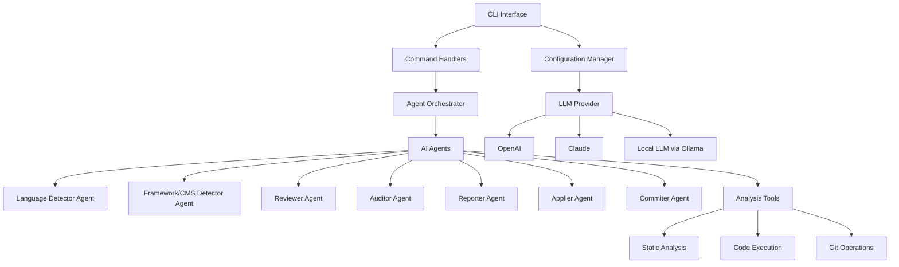

# Vaahai System Architecture

## Overview

Vaahai is a multi-AI agent CLI tool built on Microsoft's Autogen Framework. It provides code review, audit, generation, and scaffolding capabilities through a collection of specialized AI agents working together.

## System Architecture Diagram

## Core Components

### CLI Interface
The entry point for user interactions, built with Typer and InquirerPy. Handles command parsing, argument validation, and user interaction.

### Configuration Manager
Manages user preferences, API keys, and system settings using TOML-based configuration files.

### Command Handlers
Specialized modules for each command (review, audit, config, etc.) that process user inputs and delegate to the appropriate agents.

### Agent Orchestrator
Coordinates the activities of multiple AI agents using Microsoft's Autogen Framework, managing conversation flow and agent interactions.

### AI Agents
Specialized agents built on Autogen that perform specific tasks:

- **Language Detector Agent**: Identifies programming languages in code files
- **Framework/CMS Detector Agent**: Detects frameworks, libraries, and CMSs
- **Reviewer Agent**: Performs code reviews focusing on quality and best practices
- **Auditor Agent**: Conducts comprehensive code audits for security and compliance
- **Reporter Agent**: Formats and presents findings in various output formats
- **Applier Agent**: Applies suggested code changes when approved by the user
- **Commiter Agent**: Handles Git operations for committing changes

### LLM Provider
Abstracts interactions with different LLM services (OpenAI, Claude, local LLMs via Ollama).

### Analysis Tools
Integrates with static analysis tools and other utilities to enhance the capabilities of the AI agents.

## Data Flow

1. User invokes a command via the CLI
2. Command handler processes arguments and options
3. Agent Orchestrator initializes the required agents
4. Agents collaborate to perform the requested task
5. Results are formatted by the Reporter agent
6. Output is presented to the user in the specified format

## Technology Stack

| Component | Technology |
|-----------|------------|
| Programming Language | Python |
| CLI Framework | Typer with InquirerPy |
| AI Agent Orchestration | Microsoft AutoGen |
| LLM Integration | OpenAI, Claude, Junie, Ollama |
| Output Formatting | Terminal, Markdown, HTML |
| Configuration | TOML-based files |
| Package Management | Poetry |

## Extension Points

The architecture is designed to be extensible in the following ways:

1. **New Agents**: Additional specialized agents can be added to the system
2. **LLM Providers**: Support for new LLM services can be added
3. **Analysis Tools**: Integration with additional static analysis tools
4. **Output Formats**: New output formats can be supported
5. **Commands**: New CLI commands can be added to extend functionality
