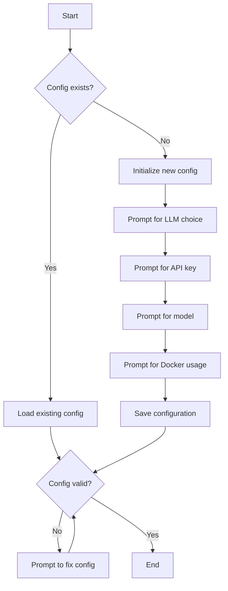
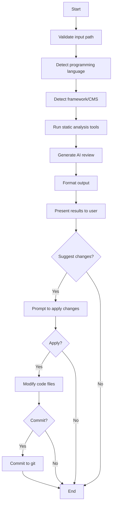
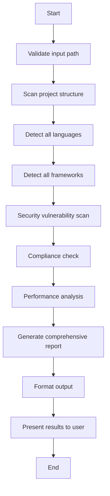

# Vaahai Business Logic

This document describes the core business logic and workflows of the Vaahai application, focusing on the "why" behind design decisions and implementation choices.

## Core Workflows

### Configuration Workflow

**Business Rules:**
1. Configuration must be validated before any command can run
2. API keys should never be stored in plain text in version control
3. Configuration precedence: CLI args > environment variables > user config > defaults
4. Users should be able to override global settings for specific projects

### Code Review Workflow

**Business Rules:**
1. Never modify code without explicit user permission
2. Always validate file paths before processing
3. Skip binary files and respect .gitignore patterns
4. Provide context-aware reviews based on detected language and framework
5. Allow users to selectively apply suggested changes

### Code Audit Workflow

**Business Rules:**
1. Audit should be thorough and cover multiple aspects (security, compliance, performance)
2. Results should be categorized by severity (critical, high, medium, low)
3. Provide actionable recommendations for each issue
4. Include references to best practices and standards

## Decision Logic

### Language Detection

The language detection process follows this decision tree:

1. Check file extension against known mappings
2. If extension is ambiguous, analyze file content for language-specific patterns
3. If still uncertain, use LLM to analyze code structure and syntax
4. Assign confidence score based on the detection method

### Framework Detection

Framework detection uses these heuristics:

1. Look for framework-specific files and directories (e.g., package.json for Node.js)
2. Check for framework-specific imports and dependencies
3. Analyze code patterns typical to specific frameworks
4. Use LLM to identify architectural patterns associated with frameworks

### Review Depth Selection

The depth of review is determined by:

1. User-specified depth parameter (quick, standard, deep)
2. Size and complexity of the codebase
3. Available time and computational resources
4. Specific focus areas requested by the user

## Agent Collaboration Logic

The multi-agent system follows these collaboration rules:

1. **Specialization**: Each agent has a specific role and expertise
2. **Information Sharing**: Agents share context and findings with each other
3. **Sequential Processing**: Some tasks must be completed in order (e.g., language detection before review)
4. **Parallel Processing**: Independent tasks can run concurrently
5. **Consensus Building**: When agents disagree, they work to reach consensus or defer to the orchestrator
6. **Fallback Mechanisms**: If an agent fails, others can compensate or provide alternative approaches

## Configuration Logic

The configuration system follows these principles:

1. **Layered Configuration**: Multiple sources with clear precedence
2. **Validation**: All configuration values are validated against a schema
3. **Sensible Defaults**: Reasonable default values for all settings
4. **Environment Awareness**: Adapt to the execution environment
5. **Security**: Sensitive values are handled securely

## Output Formatting Logic

Output formatting decisions are based on:

1. User-specified format preference
2. Terminal capabilities
3. Content type and complexity
4. Interactive vs. non-interactive mode

## Error Handling Strategy

The error handling follows this decision tree:

1. Is the error recoverable? If yes, attempt recovery
2. Is there a fallback approach? If yes, try the alternative
3. Can the error be explained clearly? Provide actionable feedback
4. Is it a critical error? Terminate with clear explanation
5. Otherwise, continue with reduced functionality and warning

## Performance Optimization Logic

Performance decisions are guided by:

1. User-specified time constraints
2. Size and complexity of the codebase
3. Available system resources
4. Required depth of analysis
5. Opportunity for parallel processing

## Security Considerations

Security decisions follow these principles:

1. Never expose API keys or sensitive information
2. Validate all user inputs
3. Respect file permissions
4. Use secure defaults
5. Provide clear security-related feedback
