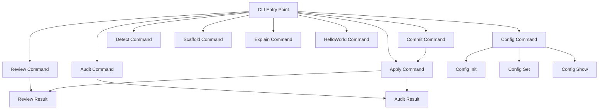

# VaahAI CLI Architecture

This document details the command-line interface (CLI) architecture for VaahAI, explaining how commands are structured, processed, and executed.

## CLI Overview

VaahAI implements a modern, user-friendly CLI using the Typer framework with InquirerPy for interactive prompts. The CLI provides access to all VaahAI functionality through a consistent command structure.

## Command Structure

VaahAI uses a nested command structure with the following pattern:

```
vaahai [global_options] command [command_options] [arguments]
```

### Global Options

Options that apply to all commands:

- `--verbose`: Increase output verbosity
- `--quiet`: Suppress non-essential output
- `--config-file`: Specify alternative configuration file
- `--no-color`: Disable colored output
- `--help`: Show help message and exit
- `--version`: Show version information and exit

### Commands

Top-level commands represent major functionality areas:

- `config`: Configuration management
- `review`: Code review
- `audit`: Code audit
- `apply`: Apply suggested changes
- `commit`: Commit applied changes
- `detect`: Detect languages and frameworks
- `scaffold`: Generate code scaffolding
- `explain`: Explain code functionality
- `helloworld`: Test configuration and connectivity

### Subcommands

Commands may have subcommands for more specific functionality:

- `config init`: Initialize configuration
- `config set`: Set configuration values
- `config show`: Display current configuration

## Command Implementation

### Command Base Class

All commands inherit from a base command class that provides common functionality:

```python
class Command:
    """Base class for all VaahAI commands."""
    
    def __init__(self, config_manager):
        """Initialize the command with configuration."""
        self.config_manager = config_manager
    
    def run(self, **kwargs):
        """Run the command with the provided arguments."""
        raise NotImplementedError("Commands must implement run method")
    
    def validate_args(self, **kwargs):
        """Validate command arguments."""
        # Default implementation
```

### Command Registration

Commands are registered with the CLI using Typer's decorator pattern:

```python
app = typer.Typer()

@app.command()
def review(
    path: str = typer.Argument(..., help="Path to file or directory to review"),
    depth: str = typer.Option("standard", help="Review depth (quick, standard, deep)"),
    focus: str = typer.Option("all", help="Focus area (quality, security, performance, all)"),
    output: str = typer.Option("terminal", help="Output format (terminal, markdown, html)"),
):
    """Review code for quality, bugs, and best practices."""
    command = ReviewCommand(get_config_manager())
    command.run(path=path, depth=depth, focus=focus, output=output)
```

### Command Execution Flow

1. **Argument Parsing**: Typer parses command-line arguments
2. **Command Instantiation**: Command object is created
3. **Argument Validation**: Command validates its arguments
4. **Command Execution**: Command's `run` method is called
5. **Result Presentation**: Command outputs results

## Interactive Prompts

VaahAI uses InquirerPy for interactive prompts when needed:

```python
def prompt_for_llm_provider():
    """Prompt user to select an LLM provider."""
    questions = [
        {
            "type": "list",
            "name": "provider",
            "message": "Select LLM provider:",
            "choices": ["OpenAI", "Claude", "Junie", "Ollama"],
        }
    ]
    answers = inquirer.prompt(questions)
    return answers["provider"].lower()
```

## Output Formatting

The CLI supports multiple output formats:

### Terminal Output

Rich, colored output for interactive use:

```
✓ Review completed for example.py
  
  Issues found: 3 (1 critical, 1 high, 1 medium)
  
  CRITICAL: SQL Injection Vulnerability
  Line 10: User input is concatenated into SQL query
  Recommendation: Use parameterized queries
  
  HIGH: Missing Error Handling
  Lines 5-6: No error handling for file operations
  Recommendation: Add try/except blocks
```

### Markdown Output

Structured markdown for documentation:

```markdown
# Code Review: example.py

## Summary
- **Critical Issues:** 1
- **High Issues:** 1
- **Medium Issues:** 1

## Issues

### CRITICAL: SQL Injection Vulnerability
- **Line:** 10
- **Description:** User input is concatenated into SQL query
- **Recommendation:** Use parameterized queries
```

### HTML Output

Rich HTML for reports and sharing:

```html
<h1>Code Review: example.py</h1>
<div class="summary">
  <h2>Summary</h2>
  <ul>
    <li><span class="critical">Critical Issues: 1</span></li>
    <li><span class="high">High Issues: 1</span></li>
    <li><span class="medium">Medium Issues: 1</span></li>
  </ul>
</div>
```

## Progress Indication

For long-running operations, the CLI provides progress indication:

```python
with Progress() as progress:
    task = progress.add_task("Reviewing code...", total=100)
    # Perform review in chunks
    for i in range(10):
        # Process chunk
        progress.update(task, advance=10)
```

## Error Handling

The CLI implements consistent error handling:

```python
try:
    # Command execution
except ConfigError as e:
    console.print(f"[bold red]Configuration error:[/] {e}")
    sys.exit(1)
except ApiError as e:
    console.print(f"[bold red]API error:[/] {e}")
    sys.exit(2)
except Exception as e:
    if verbose:
        console.print_exception()
    else:
        console.print(f"[bold red]Error:[/] {e}")
    sys.exit(99)
```

## Command Documentation

Each command includes comprehensive help documentation:

```
Usage: vaahai review [OPTIONS] PATH

  Review code for quality, bugs, and best practices.

Arguments:
  PATH  Path to file or directory to review  [required]

Options:
  --depth [quick|standard|deep]     Review depth  [default: standard]
  --focus [quality|security|performance|all]
                                    Focus area  [default: all]
  --output [terminal|markdown|html]
                                    Output format  [default: terminal]
  --help                            Show this message and exit.
```

## Command Relationships



## Exit Codes

VaahAI uses consistent exit codes:

- `0`: Success
- `1`: Configuration error
- `2`: API error
- `3`: Input error
- `4`: Execution error
- `99`: Unexpected error

## Environment Variables

The CLI respects environment variables:

- `VAAHAI_CONFIG_FILE`: Alternative configuration file
- `VAAHAI_VERBOSE`: Enable verbose output
- `VAAHAI_NO_COLOR`: Disable colored output
- `VAAHAI_*`: Configuration overrides

## Technical Implementation

### CLI Entry Point

```python
def main():
    """VaahAI CLI entry point."""
    try:
        app()
    except Exception as e:
        if os.environ.get("VAAHAI_VERBOSE"):
            traceback.print_exc()
        else:
            print(f"Error: {e}", file=sys.stderr)
        sys.exit(99)

if __name__ == "__main__":
    main()
```

### Command Implementation Pattern

```python
class ReviewCommand(Command):
    """Command for code review."""
    
    def run(self, path, depth, focus, output):
        """Run code review on the specified path."""
        # Validate arguments
        self.validate_args(path=path, depth=depth, focus=focus, output=output)
        
        # Initialize components
        agent_factory = AgentFactory(self.config_manager)
        
        # Create and run agents
        language_detector = agent_factory.create_agent("language_detector")
        languages = language_detector.detect(path)
        
        framework_detector = agent_factory.create_agent("framework_detector")
        frameworks = framework_detector.detect(path, languages)
        
        reviewer = agent_factory.create_agent("reviewer")
        review_results = reviewer.review(path, languages, frameworks, depth, focus)
        
        reporter = agent_factory.create_agent("reporter")
        report = reporter.format_review(review_results, output)
        
        # Output results
        if output == "terminal":
            console.print(report)
        elif output == "markdown":
            with open(f"review_{datetime.now().strftime('%Y%m%d_%H%M%S')}.md", "w") as f:
                f.write(report)
        elif output == "html":
            with open(f"review_{datetime.now().strftime('%Y%m%d_%H%M%S')}.html", "w") as f:
                f.write(report)
```

## Best Practices

1. **Consistent Interface**: Maintain consistent command structure and options
2. **Comprehensive Help**: Provide detailed help for all commands and options
3. **Progressive Disclosure**: Show basic information by default, details on request
4. **Error Handling**: Provide clear error messages and appropriate exit codes
5. **Confirmation**: Confirm before destructive operations
6. **Progress Indication**: Show progress for long-running operations
7. **Output Control**: Allow control over output verbosity and format
