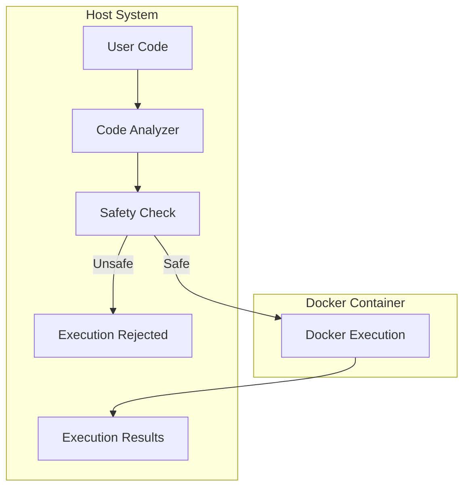

# VaahAI Code Execution System

This document details the secure code execution system in VaahAI, explaining how code is safely executed in isolated environments.

## Code Execution Overview

VaahAI implements a secure code execution system that allows for safe execution of code during analysis, testing, and application of changes. The system uses Docker containers to provide isolation and security.

## Security Architecture



## Safety Checks

Before executing any code, VaahAI performs multiple safety checks:

### Static Analysis

1. **Dangerous Function Detection**: Identifies calls to potentially dangerous functions
2. **Network Access Detection**: Identifies attempts to access network resources
3. **File System Access Detection**: Identifies suspicious file system operations
4. **Process Execution Detection**: Identifies attempts to execute external processes
5. **Import Analysis**: Checks for suspicious or dangerous imports

### Execution Policy

The execution policy defines what code can be executed:

1. **Allowlisted Functions**: Only approved functions can be executed
2. **Resource Limits**: Strict limits on CPU, memory, and execution time
3. **Network Isolation**: No network access by default
4. **File System Isolation**: Limited access to file system
5. **User Confirmation**: Explicit user confirmation for execution

## Docker Integration

VaahAI uses Docker for isolated code execution:

### Container Configuration

```yaml
# Docker container configuration
image: vaahai/code-execution:latest
memory: 2g
cpu_limit: 2
network_mode: none
read_only: true
volumes:
  - type: bind
    source: ./code
    target: /code
    read_only: true
  - type: bind
    source: ./output
    target: /output
    read_only: false
```

### Container Lifecycle

1. **Creation**: Container is created with isolated environment
2. **Code Injection**: Code to execute is injected into container
3. **Execution**: Code is executed with resource limits
4. **Result Capture**: Execution results are captured
5. **Cleanup**: Container is removed after execution

## Execution Process

The code execution process follows these steps:

1. **Code Preparation**: Code is prepared for execution
2. **Safety Analysis**: Static analysis is performed
3. **User Confirmation**: User confirms execution (if required)
4. **Container Creation**: Docker container is created
5. **Code Execution**: Code is executed in container
6. **Result Capture**: Output, errors, and execution status are captured
7. **Result Analysis**: Results are analyzed and formatted
8. **Container Cleanup**: Container is removed

## Language Support

VaahAI supports execution of multiple programming languages:

### Python

```python
def execute_python(code, timeout=10):
    """Execute Python code in a secure container."""
    container = create_container("python")
    try:
        container.start()
        container.exec_run(f"python -c '{code}'", timeout=timeout)
        output = container.logs().decode("utf-8")
        return output
    finally:
        container.remove(force=True)
```

### JavaScript/Node.js

```python
def execute_javascript(code, timeout=10):
    """Execute JavaScript code in a secure container."""
    container = create_container("node")
    try:
        container.start()
        container.exec_run(f"node -e '{code}'", timeout=timeout)
        output = container.logs().decode("utf-8")
        return output
    finally:
        container.remove(force=True)
```

### Other Languages

Similar execution functions are implemented for:

- Ruby
- Go
- Java
- C#
- PHP
- Rust

## Execution Manager

The `ExecutionManager` class coordinates code execution:

```python
class ExecutionManager:
    """Manages secure code execution."""
    
    def __init__(self, config):
        """Initialize with configuration."""
        self.config = config
        self.docker_client = docker.from_env()
    
    def execute(self, code, language, timeout=10):
        """Execute code in the specified language."""
        # Perform safety checks
        self._check_safety(code, language)
        
        # Create and configure container
        container = self._create_container(language)
        
        try:
            # Execute code
            container.start()
            result = container.exec_run(
                self._get_execution_command(code, language),
                timeout=timeout
            )
            
            # Process result
            return {
                "exit_code": result.exit_code,
                "output": result.output.decode("utf-8"),
                "success": result.exit_code == 0
            }
        finally:
            # Cleanup
            container.remove(force=True)
    
    def _check_safety(self, code, language):
        """Check if code is safe to execute."""
        # Implementation
    
    def _create_container(self, language):
        """Create a container for the specified language."""
        # Implementation
    
    def _get_execution_command(self, code, language):
        """Get the command to execute code in the specified language."""
        # Implementation
```

## Safety Analyzer

The `SafetyAnalyzer` class performs static analysis:

```python
class SafetyAnalyzer:
    """Analyzes code for safety concerns."""
    
    def __init__(self, config):
        """Initialize with configuration."""
        self.config = config
        self._load_patterns()
    
    def analyze(self, code, language):
        """Analyze code for safety concerns."""
        concerns = []
        
        # Check for dangerous patterns
        for pattern, description in self._get_patterns(language):
            if re.search(pattern, code):
                concerns.append({
                    "pattern": pattern,
                    "description": description,
                    "severity": "high"
                })
        
        # Language-specific analysis
        if language == "python":
            concerns.extend(self._analyze_python(code))
        elif language == "javascript":
            concerns.extend(self._analyze_javascript(code))
        
        return concerns
    
    def _load_patterns(self):
        """Load dangerous patterns from configuration."""
        # Implementation
    
    def _get_patterns(self, language):
        """Get dangerous patterns for the specified language."""
        # Implementation
    
    def _analyze_python(self, code):
        """Perform Python-specific safety analysis."""
        # Implementation
    
    def _analyze_javascript(self, code):
        """Perform JavaScript-specific safety analysis."""
        # Implementation
```

## Resource Monitoring

VaahAI monitors resource usage during execution:

```python
class ResourceMonitor:
    """Monitors resource usage during execution."""
    
    def __init__(self, container, limits):
        """Initialize with container and limits."""
        self.container = container
        self.limits = limits
        self.stats = []
    
    def start(self):
        """Start monitoring resources."""
        self.monitoring = True
        self.thread = threading.Thread(target=self._monitor)
        self.thread.daemon = True
        self.thread.start()
    
    def stop(self):
        """Stop monitoring resources."""
        self.monitoring = False
        self.thread.join()
        return self.stats
    
    def _monitor(self):
        """Monitor resource usage."""
        while self.monitoring:
            try:
                stats = self.container.stats(stream=False)
                self.stats.append(stats)
                
                # Check if limits are exceeded
                if self._limits_exceeded(stats):
                    self.container.kill()
                    break
                
                time.sleep(0.1)
            except:
                break
    
    def _limits_exceeded(self, stats):
        """Check if resource limits are exceeded."""
        # Implementation
```

## Execution Results

Execution results include:

1. **Standard Output**: Captured stdout
2. **Standard Error**: Captured stderr
3. **Exit Code**: Process exit code
4. **Execution Time**: Time taken for execution
5. **Resource Usage**: CPU and memory usage
6. **Errors**: Any errors during execution

## Error Handling

VaahAI handles various execution errors:

1. **Timeout**: Execution exceeded time limit
2. **Resource Limit**: Execution exceeded resource limits
3. **Security Violation**: Execution attempted unsafe operation
4. **Runtime Error**: Error during code execution
5. **Container Error**: Error in container management

## User Interface

The execution system provides user feedback:

1. **Confirmation**: Prompt for user confirmation
2. **Progress**: Indication of execution progress
3. **Results**: Formatted execution results
4. **Warnings**: Security or performance warnings
5. **Errors**: Clear error messages

## Configuration Options

The execution system can be configured:

```toml
[execution]
enabled = true
require_confirmation = true
timeout = 10
memory_limit = "2g"
cpu_limit = 2
network_access = false

[execution.languages]
python = true
javascript = true
ruby = true
go = true
java = true
csharp = true
php = true
rust = true
```

## Docker Images

VaahAI uses specialized Docker images:

1. **Base Image**: Common utilities and security settings
2. **Language Images**: Language-specific environments
3. **Tool Images**: Images with additional tools installed

## Security Best Practices

The execution system follows security best practices:

1. **Principle of Least Privilege**: Minimal permissions
2. **Defense in Depth**: Multiple security layers
3. **Isolation**: Complete isolation from host system
4. **Resource Limits**: Strict resource constraints
5. **User Confirmation**: Explicit user approval
6. **Audit Logging**: Logging of all executions

## Limitations

The execution system has some limitations:

1. **Performance Overhead**: Docker adds some overhead
2. **Limited Environment**: Not all libraries available
3. **No Network Access**: Cannot access external resources
4. **Limited File Access**: Restricted file system access
5. **Execution Time**: Limited execution time

## Future Enhancements

Planned enhancements to the execution system:

1. **More Languages**: Support for additional languages
2. **Interactive Execution**: REPL-like interactive execution
3. **Persistent Environments**: Reusable execution environments
4. **Custom Images**: User-defined Docker images
5. **Remote Execution**: Execution on remote servers
