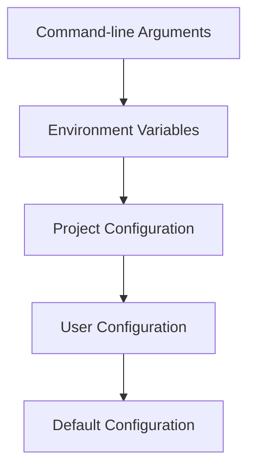

# VaahAI Configuration System

This document details the configuration system architecture for VaahAI, explaining how configuration is managed, stored, and accessed throughout the application.

## Configuration System Overview

VaahAI implements a layered configuration system that provides flexibility, security, and ease of use. The configuration system handles everything from LLM API keys to user preferences and project-specific settings.

## Configuration Layers

The configuration system uses a layered approach with precedence from highest to lowest:

1. **Command-line Arguments**: Highest precedence, overrides all other settings
2. **Environment Variables**: Override file-based configuration
3. **Project-specific Configuration**: Settings for the current project
4. **User Configuration**: Global user preferences
5. **Default Configuration**: Built-in defaults



## Configuration Storage

### File Locations

- **Default Configuration**: Built into the application
- **User Configuration**: `~/.vaahai/config.toml`
- **Project Configuration**: `.vaahai/config.toml` in the project directory

### File Format

VaahAI uses TOML (Tom's Obvious, Minimal Language) for configuration files due to its readability and structure. Example:

```toml
# VaahAI Configuration

[llm]
provider = "openai"
model = "gpt-4"

[docker]
enabled = true
image = "vaahai/code-execution:latest"

[review]
depth = "standard"
focus = "all"
```

## Configuration Sections

### LLM Configuration

Controls the LLM provider and model settings.

```toml
[llm]
provider = "openai"  # openai, claude, junie, ollama
model = "gpt-4"      # Model name
temperature = 0.7    # Response randomness (0.0-1.0)
max_tokens = 2000    # Maximum response length

[llm.openai]
api_key = ""         # Will be stored in system keyring

[llm.claude]
api_key = ""         # Will be stored in system keyring

[llm.junie]
api_key = ""         # Will be stored in system keyring

[llm.ollama]
host = "http://localhost:11434"
```

### Docker Configuration

Controls Docker usage for code execution.

```toml
[docker]
enabled = true
image = "vaahai/code-execution:latest"
memory_limit = "2g"
cpu_limit = 2
network = "none"
```

### Review Configuration

Controls code review behavior.

```toml
[review]
depth = "standard"   # quick, standard, deep
focus = "all"        # quality, security, performance, all
output = "terminal"  # terminal, markdown, html
```

### Audit Configuration

Controls code audit behavior.

```toml
[audit]
depth = "standard"   # standard, deep
compliance = ["owasp", "pci-dss"]
security = true
performance = true
architecture = true
output = "markdown"  # terminal, markdown, html
```

### Agent Configuration

Controls agent behavior and collaboration.

```toml
[agents]
language_detector = true
framework_detector = true
reviewer = true
auditor = true
reporter = true
applier = true
committer = true

[agents.reviewer]
prompt_template = "default"  # or path to custom template

[agents.auditor]
prompt_template = "default"  # or path to custom template
```

### Output Configuration

Controls output formatting and destinations.

```toml
[output]
format = "terminal"  # terminal, markdown, html
color = true
verbosity = "normal" # minimal, normal, verbose
save_path = ""       # Path to save reports, empty for no saving
```

## Configuration Management

### Configuration Manager

The `ConfigManager` class is responsible for:

1. Loading configuration from all sources
2. Applying the precedence rules
3. Validating configuration values
4. Providing access to configuration values
5. Handling secure storage of sensitive information

### Configuration Schema

The configuration schema defines:

1. Valid configuration sections and keys
2. Data types and validation rules
3. Default values
4. Sensitive fields that require secure storage

### Environment Variables

Environment variables can override configuration values using the format:

```
VAAHAI_SECTION_KEY=value
```

Examples:
- `VAAHAI_LLM_PROVIDER=openai`
- `VAAHAI_REVIEW_DEPTH=quick`
- `VAAHAI_OUTPUT_FORMAT=markdown`

### Secure Storage

Sensitive information like API keys is stored securely:

1. API keys are never stored in plain text in configuration files
2. System keyring is used for secure storage
3. Environment variables can be used for CI/CD environments
4. Memory-only options are available for enhanced security

## Configuration Workflow

### Initial Configuration

1. User runs `vaahai config init`
2. Interactive wizard collects necessary information
3. Configuration is validated and stored
4. Sensitive information is stored in the system keyring

### Configuration Updates

1. User runs `vaahai config set section.key value`
2. Configuration is updated and validated
3. Changes are stored in the appropriate configuration file

### Configuration Display

1. User runs `vaahai config show`
2. Current effective configuration is displayed
3. Sensitive values are masked

## Configuration Validation

The configuration system validates:

1. Required fields are present
2. Values are of the correct type
3. Values are within valid ranges or options
4. Dependencies between configuration options are satisfied

## Configuration Migration

When the configuration schema changes:

1. Existing configuration is loaded
2. Missing fields are added with default values
3. Deprecated fields are handled appropriately
4. User is notified of significant changes

## Configuration Extension

The configuration system supports:

1. Custom sections for plugins
2. User-defined values for customization
3. Project-specific overrides for team settings

## Technical Implementation

### Configuration Classes

```python
class ConfigManager:
    """Manages VaahAI configuration from all sources."""

    def __init__(self):
        """Initialize the configuration manager."""
        self._config = {}
        self._load_defaults()
        self._load_user_config()
        self._load_project_config()
        self._load_env_vars()
        self._validate()

    def get(self, path, default=None):
        """Get a configuration value by path."""
        # Implementation

    def set(self, path, value):
        """Set a configuration value by path."""
        # Implementation

    def save(self):
        """Save the current configuration."""
        # Implementation
```

### Configuration Schema

```python
CONFIG_SCHEMA = {
    "llm": {
        "provider": {
            "type": "string",
            "enum": ["openai", "claude", "junie", "ollama"],
            "default": "openai"
        },
        "model": {
            "type": "string",
            "default": "gpt-4"
        },
        # More fields
    },
    # More sections
}
```

### Secure Storage

```python
class SecureStorage:
    """Handles secure storage of sensitive information."""

    def store(self, key, value):
        """Store a value securely."""
        # Implementation using system keyring

    def retrieve(self, key):
        """Retrieve a securely stored value."""
        # Implementation using system keyring

    def delete(self, key):
        """Delete a securely stored value."""
        # Implementation using system keyring
```

## Best Practices

1. **Layered Configuration**: Use the appropriate configuration layer for each setting
2. **Environment Variables**: Use environment variables for CI/CD and ephemeral settings
3. **Secure Storage**: Never store API keys in plain text configuration files
4. **Validation**: Always validate configuration before use
5. **Defaults**: Provide sensible defaults for all configuration options
6. **Documentation**: Keep configuration documentation up to date
7. **Backward Compatibility**: Maintain compatibility with older configuration formats
