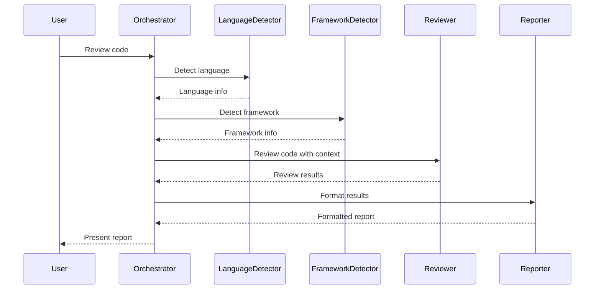

# Vaahai Design Patterns

This document describes the key design patterns used in the Vaahai project to ensure consistency, maintainability, and extensibility.

## Architectural Patterns

### Multi-Agent System

Vaahai uses a multi-agent architecture based on Microsoft's Autogen Framework. This pattern allows specialized agents to collaborate on complex tasks through message passing and shared context.



### Command Pattern

CLI commands are implemented using the Command pattern, which encapsulates a request as an object, allowing parameterization of clients with different requests and queue or log requests.

```python
class Command:
    def execute(self, *args, **kwargs):
        pass

class ReviewCommand(Command):
    def execute(self, path, output_format="terminal", **options):
        # Implementation
        pass
```

### Factory Pattern

Agent creation is handled by a Factory pattern, which centralizes agent instantiation and configuration.

```python
class AgentFactory:
    @staticmethod
    def create(agent_type, config, **kwargs):
        if agent_type == "language_detector":
            return LanguageDetectorAgent(config, **kwargs)
        elif agent_type == "framework_detector":
            return FrameworkDetectorAgent(config, **kwargs)
        # ...
```

### Strategy Pattern

Different strategies for code analysis, output formatting, and LLM interaction are implemented using the Strategy pattern.

```python
class OutputFormatter:
    def format(self, data):
        pass

class MarkdownFormatter(OutputFormatter):
    def format(self, data):
        # Convert data to markdown
        pass

class HTMLFormatter(OutputFormatter):
    def format(self, data):
        # Convert data to HTML
        pass
```

### Singleton Pattern

The Configuration Manager uses a Singleton pattern to ensure a single point of access to configuration data.

```python
class ConfigManager:
    _instance = None
    
    def __new__(cls):
        if cls._instance is None:
            cls._instance = super(ConfigManager, cls).__new__(cls)
            cls._instance._initialize()
        return cls._instance
```

## Code Organization Patterns

### Module Structure

Vaahai follows a modular structure with clear separation of concerns:

```
vaahai/
├── agents/           # AI agent implementations
├── commands/         # CLI command handlers
├── config/           # Configuration management
├── utils/            # Utility functions
└── test/             # Test cases
```

### Dependency Injection

Dependencies are injected into components rather than created internally, improving testability and flexibility.

```python
class ReviewerAgent:
    def __init__(self, config, language_detector=None, framework_detector=None):
        self.config = config
        self.language_detector = language_detector or AgentFactory.create("language_detector", config)
        self.framework_detector = framework_detector or AgentFactory.create("framework_detector", config)
```

### Composition Over Inheritance

Vaahai favors composition over inheritance for building complex behaviors.

```python
class ReviewCommand:
    def __init__(self, config=None):
        self.config = config or ConfigManager()
        self.language_detector = AgentFactory.create("language_detector", self.config)
        self.reviewer = AgentFactory.create("reviewer", self.config)
        self.reporter = AgentFactory.create("reporter", self.config)
```

## Error Handling Patterns

### Result Objects

Operations return result objects that encapsulate success/failure status and data.

```python
class Result:
    def __init__(self, success, data=None, error=None):
        self.success = success
        self.data = data
        self.error = error
        
    @classmethod
    def success(cls, data=None):
        return cls(True, data=data)
        
    @classmethod
    def failure(cls, error):
        return cls(False, error=error)
```

### Exception Handling

Exceptions are caught at appropriate boundaries and translated into user-friendly messages.

```python
try:
    result = agent.run(path)
    return result
except AgentError as e:
    logger.error(f"Agent error: {e}")
    return Result.failure(f"Failed to run agent: {e}")
except Exception as e:
    logger.exception("Unexpected error")
    return Result.failure("An unexpected error occurred")
```

## Testing Patterns

### Mocking

External dependencies like LLM APIs are mocked during testing.

```python
@pytest.fixture
def mock_llm():
    with patch("vaahai.llm.OpenAIProvider") as mock:
        mock.return_value.generate.return_value = "Mocked response"
        yield mock
        
def test_reviewer_agent(mock_llm):
    agent = ReviewerAgent(config=mock_config)
    result = agent.review("/path/to/file")
    assert result.success
```

### Dependency Injection for Testing

Components accept dependencies that can be replaced with test doubles.

```python
def test_review_command():
    mock_reviewer = Mock()
    mock_reviewer.review.return_value = Result.success({"issues": []})
    
    cmd = ReviewCommand(config=mock_config)
    cmd.reviewer = mock_reviewer
    
    result = cmd.execute("/path/to/file")
    assert result.success
```

## Extension Patterns

### Plugin System

Vaahai uses a plugin system for extending functionality without modifying core code.

```python
class PluginManager:
    def __init__(self):
        self.plugins = {}
        
    def register(self, name, plugin):
        self.plugins[name] = plugin
        
    def get_plugin(self, name):
        return self.plugins.get(name)
```

### Hook Points

Key extension points are defined using hook functions that can be overridden.

```python
def pre_review_hook(context):
    # Custom logic before review
    return context

def post_review_hook(context, result):
    # Custom logic after review
    return result
```

## Autogen-Specific Patterns

### Agent Communication

Agents communicate through structured message passing using Autogen's conversation mechanisms.

```python
# Agent sending a message
assistant.send(
    message="I've analyzed the code and found 3 issues",
    recipient=manager
)

# Agent receiving a message
@assistant.register_reply
def reply_to_message(message):
    # Process message
    return response
```

### Group Chat Management

Complex multi-agent interactions are managed through Autogen's GroupChat and GroupChatManager.

```python
# Create a group chat
group_chat = autogen.GroupChat(
    agents=[language_detector, framework_detector, reviewer, reporter],
    messages=[],
    max_round=10
)

# Create a manager
manager = autogen.GroupChatManager(group_chat=group_chat)

# Initiate the chat
manager.initiate_chat(
    message="Review the code in /path/to/project"
)
```
