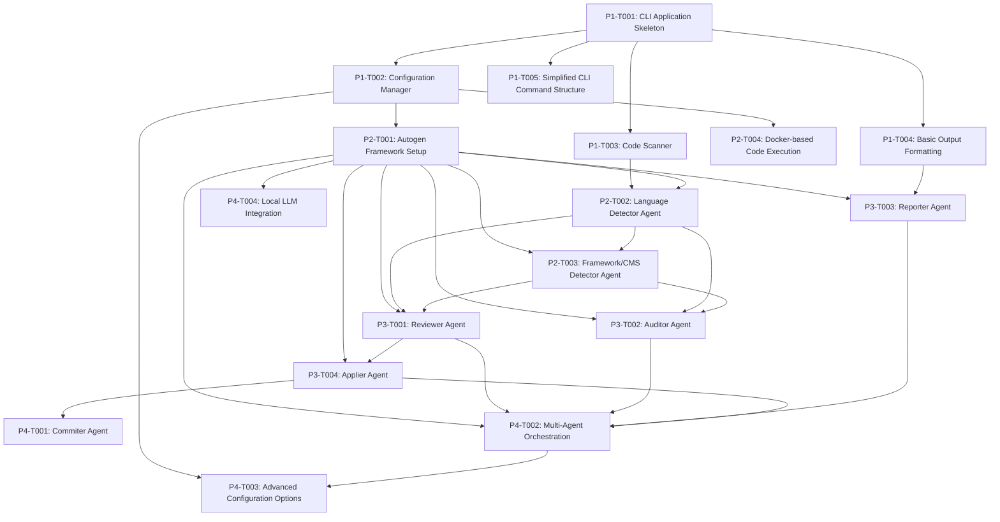

# Vaahai Implementation Roadmap

This document outlines the phased implementation plan for the Vaahai project, breaking down the development into manageable tasks with clear dependencies and milestones.

## Phase 1: Core Infrastructure

### P1-T001: CLI Application Skeleton
**Status**: Not Started

**Description**: Set up the basic CLI application structure using Typer and implement command placeholders.

**Components**:
- Main CLI entry point
- Command registration
- Help text and documentation
- Version information

**Implementation Notes**:
- Use Typer for CLI framework
- Set up Poetry for dependency management
- Implement basic error handling

**Dependencies**: None

### P1-T002: Configuration Manager
**Status**: Not Started

**Description**: Implement a configuration management system that handles user preferences, API keys, and system settings.

**Components**:
- TOML-based configuration file
- Environment variable support
- Configuration validation
- Secure API key storage

**Implementation Notes**:
- Use TOML for configuration file format
- Support multiple configuration sources with precedence
- Implement validation for configuration values

**Dependencies**: P1-T001

### P1-T003: Code Scanner
**Status**: Not Started

**Description**: Implement a system to scan and analyze code files and directories.

**Components**:
- File type detection
- Directory traversal
- Filtering (by extension, size, pattern)
- Basic metadata extraction

**Implementation Notes**:
- Respect .gitignore patterns
- Handle binary files appropriately
- Implement size limits for large files

**Dependencies**: P1-T001, P1-T002

### P1-T004: Basic Output Formatting
**Status**: Not Started

**Description**: Implement formatters for different output types (terminal, markdown, HTML).

**Components**:
- Terminal output with Rich
- Markdown formatter
- HTML formatter
- Output selection logic

**Implementation Notes**:
- Use Rich for terminal formatting
- Generate clean, readable markdown
- Create styled HTML output

**Dependencies**: P1-T001

### P1-T005: Simplified CLI Command Structure
**Status**: Not Started

**Description**: Refine the CLI command structure for better user experience.

**Components**:
- Command hierarchy
- Parameter standardization
- Command aliases

**Implementation Notes**:
- Ensure consistent parameter naming
- Implement command aliases for common operations
- Add detailed help text

**Dependencies**: P1-T001

## Phase 2: Autogen Integration

### P2-T001: Autogen Framework Setup
**Status**: Not Started

**Description**: Integrate Microsoft's Autogen Framework as the foundation for the multi-agent system.

**Components**:
- Autogen dependency integration
- Base agent classes
- Agent factory pattern
- Configuration integration

**Implementation Notes**:
- Use pyautogen package
- Set up proper versioning constraints
- Create base classes for agent integration

**Dependencies**: P1-T002

### P2-T002: Language Detector Agent
**Status**: Not Started

**Description**: Implement an agent that can detect programming languages in code files.

**Components**:
- Language detection by file extension
- Content-based language detection
- Language version estimation
- Confidence scoring

**Implementation Notes**:
- Use both heuristic and LLM-based detection
- Support multi-file projects
- Implement language feature detection

**Dependencies**: P2-T001, P1-T003

### P2-T003: Framework/CMS Detector Agent
**Status**: Not Started

**Description**: Implement an agent that can identify frameworks, libraries, and CMSs used in a project.

**Components**:
- Framework detection by file structure
- Dependency analysis
- Pattern recognition
- Version detection

**Implementation Notes**:
- Support popular frameworks across languages
- Detect multiple frameworks in a project
- Identify architectural patterns

**Dependencies**: P2-T001, P2-T002

### P2-T004: Docker-based Code Execution
**Status**: Not Started

**Description**: Implement a secure environment for executing code during analysis.

**Components**:
- Docker integration
- Language-specific containers
- Resource limiting
- Execution result capture

**Implementation Notes**:
- Use Docker SDK for Python
- Implement security measures
- Support multiple programming languages

**Dependencies**: P1-T002

## Phase 3: Review and Audit Capabilities

### P3-T001: Reviewer Agent
**Status**: Not Started

**Description**: Implement an agent that performs code reviews focusing on quality and best practices.

**Components**:
- Code quality analysis
- Best practice checking
- Style consistency
- Bug detection

**Implementation Notes**:
- Integrate with static analysis tools
- Use LLM for context-aware reviews
- Support multiple programming languages

**Dependencies**: P2-T001, P2-T002, P2-T003

### P3-T002: Auditor Agent
**Status**: Not Started

**Description**: Implement an agent that performs comprehensive code audits for security and compliance.

**Components**:
- Security vulnerability detection
- Compliance checking
- Performance analysis
- Architecture evaluation

**Implementation Notes**:
- Focus on security best practices
- Support industry standards (OWASP, PCI-DSS)
- Provide detailed explanations of issues

**Dependencies**: P2-T001, P2-T002, P2-T003

### P3-T003: Reporter Agent
**Status**: Not Started

**Description**: Implement an agent that formats and presents findings in various output formats.

**Components**:
- Report generation
- Output formatting
- Summary creation
- Visualization

**Implementation Notes**:
- Support terminal, markdown, and HTML output
- Create visually appealing reports
- Include actionable recommendations

**Dependencies**: P2-T001, P1-T004

### P3-T004: Applier Agent
**Status**: Not Started

**Description**: Implement an agent that applies suggested code changes when approved by the user.

**Components**:
- Code modification
- Change preview
- Interactive confirmation
- Backup creation

**Implementation Notes**:
- Implement safety checks
- Support interactive confirmation
- Create backups before changes

**Dependencies**: P2-T001, P3-T001

## Phase 4: Advanced Features

### P4-T001: Commiter Agent
**Status**: Not Started

**Description**: Implement an agent that handles Git operations for committing changes.

**Components**:
- Git integration
- Commit message generation
- Branch management
- Pull request creation

**Implementation Notes**:
- Use GitPython for Git operations
- Generate meaningful commit messages
- Support common Git workflows

**Dependencies**: P3-T004

### P4-T002: Multi-Agent Orchestration
**Status**: Not Started

**Description**: Implement a system for coordinating multiple agents in complex workflows.

**Components**:
- Agent communication
- Workflow definition
- Task scheduling
- Error handling

**Implementation Notes**:
- Use Autogen's GroupChat and GroupChatManager
- Implement fallback mechanisms
- Support parallel agent execution

**Dependencies**: P2-T001, P3-T001, P3-T002, P3-T003, P3-T004

### P4-T003: Advanced Configuration Options
**Status**: Not Started

**Description**: Extend the configuration system with advanced options for customization.

**Components**:
- Agent-specific configuration
- Plugin system
- Custom workflows
- Performance tuning

**Implementation Notes**:
- Maintain backward compatibility
- Implement validation for new options
- Provide sensible defaults

**Dependencies**: P1-T002, P4-T002

### P4-T004: Local LLM Integration
**Status**: Not Started

**Description**: Add support for local LLMs via Ollama.

**Components**:
- Ollama integration
- Model management
- Performance optimization
- Fallback to cloud LLMs

**Implementation Notes**:
- Support popular local models
- Implement caching for performance
- Handle resource constraints

**Dependencies**: P2-T001

## Implementation Dependencies

## Risk Assessment

| Risk | Impact | Likelihood | Mitigation |
|------|--------|------------|------------|
| Autogen API changes | High | Medium | Pin to stable version, monitor updates |
| LLM API costs | Medium | High | Implement caching, rate limiting, local LLMs |
| Performance issues with large codebases | High | Medium | Implement sampling, parallelization, progress reporting |
| Security concerns with code execution | High | Low | Use Docker isolation, resource limits, user confirmation |
| Compatibility issues across languages | Medium | Medium | Implement language-specific handlers, graceful degradation |

## MVP Definition

The Minimum Viable Product (MVP) for Vaahai includes:

1. Basic CLI structure with `config`, `review`, and `helloworld` commands
2. Configuration management with API key storage
3. Simple code scanning capabilities
4. Language detection using file extensions
5. Basic code review using a single agent
6. Terminal output formatting

This MVP will be completed by implementing:
- P1-T001: CLI Application Skeleton
- P1-T002: Configuration Manager
- P1-T003: Code Scanner
- P1-T004: Basic Output Formatting
- P2-T001: Autogen Framework Setup (partial)
- P2-T002: Language Detector Agent (basic version)
- P3-T001: Reviewer Agent (simplified version)
