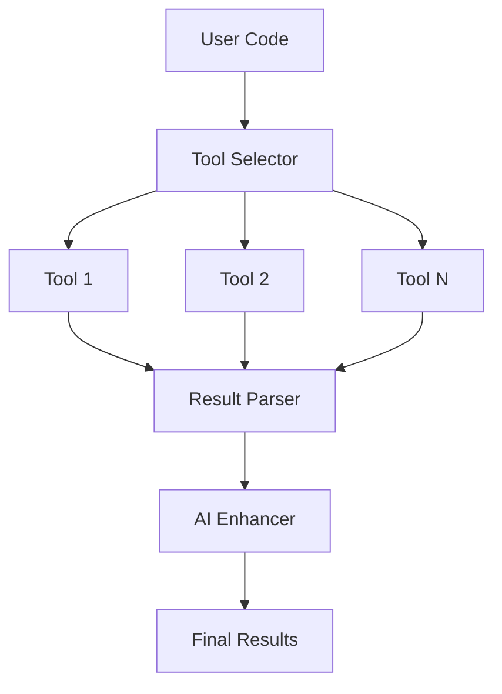

# VaahAI Static Analysis Integration

This document details how VaahAI integrates with static analysis tools to enhance code review and audit capabilities.

## Static Analysis Overview

VaahAI leverages industry-standard static analysis tools to provide deeper insights into code quality, security, and performance. These tools complement the AI-based analysis with rule-based detection of common issues.

## Integration Architecture



## Supported Tools

VaahAI integrates with multiple static analysis tools based on the programming language:

### Python

1. **Pylint**: Code quality and style checking
2. **Bandit**: Security vulnerability detection
3. **Mypy**: Type checking
4. **Flake8**: Style guide enforcement
5. **Black**: Code formatting (for suggested fixes)

### JavaScript/TypeScript

1. **ESLint**: Code quality and style checking
2. **SonarJS**: Advanced code analysis
3. **npm audit**: Dependency vulnerability checking
4. **Prettier**: Code formatting (for suggested fixes)

### Java

1. **PMD**: Code quality analysis
2. **SpotBugs**: Bug pattern detection
3. **CheckStyle**: Style guide enforcement
4. **SonarJava**: Advanced code analysis

### Go

1. **golangci-lint**: Comprehensive linting
2. **gosec**: Security-focused static analysis
3. **staticcheck**: Advanced static analysis

### Ruby

1. **RuboCop**: Code quality and style checking
2. **Brakeman**: Security vulnerability detection
3. **Reek**: Code smell detection

### PHP

1. **PHP_CodeSniffer**: Style checking
2. **PHPStan**: Static analysis
3. **PHPMD**: Mess detection

### C#

1. **StyleCop**: Style checking
2. **FxCop**: Code analysis
3. **SonarC#**: Advanced code analysis

## Tool Execution

VaahAI executes static analysis tools in a secure environment:

```python
class StaticAnalysisTool:
    """Base class for static analysis tools."""
    
    def __init__(self, config):
        """Initialize with configuration."""
        self.config = config
    
    def analyze(self, path):
        """Analyze code at the specified path."""
        raise NotImplementedError("Tools must implement analyze")
    
    def parse_results(self, output):
        """Parse tool output into structured results."""
        raise NotImplementedError("Tools must implement parse_results")
    
    def get_command(self, path):
        """Get the command to run the tool."""
        raise NotImplementedError("Tools must implement get_command")
    
    def execute(self, path):
        """Execute the tool and return parsed results."""
        command = self.get_command(path)
        result = subprocess.run(
            command,
            capture_output=True,
            text=True,
            check=False
        )
        return self.parse_results(result.stdout, result.stderr)
```

### Example: Pylint Integration

```python
class PylintTool(StaticAnalysisTool):
    """Pylint integration for Python code analysis."""
    
    def get_command(self, path):
        """Get the pylint command for the specified path."""
        return [
            "pylint",
            "--output-format=json",
            path
        ]
    
    def parse_results(self, stdout, stderr):
        """Parse pylint JSON output into structured results."""
        try:
            issues = json.loads(stdout)
            return [
                {
                    "tool": "pylint",
                    "type": issue["type"],
                    "message": issue["message"],
                    "line": issue["line"],
                    "column": issue["column"],
                    "symbol": issue["symbol"],
                    "module": issue["module"],
                    "path": issue["path"],
                    "severity": self._map_severity(issue["type"])
                }
                for issue in issues
            ]
        except json.JSONDecodeError:
            return []
    
    def _map_severity(self, issue_type):
        """Map pylint issue type to severity."""
        mapping = {
            "convention": "low",
            "refactor": "low",
            "warning": "medium",
            "error": "high",
            "fatal": "critical"
        }
        return mapping.get(issue_type, "medium")
```

## Tool Selection

VaahAI selects appropriate tools based on:

1. **Language**: Programming language of the code
2. **File Type**: Type of file being analyzed
3. **Analysis Focus**: Security, quality, or performance focus
4. **User Preferences**: User-configured tool preferences

```python
class ToolSelector:
    """Selects appropriate static analysis tools."""
    
    def __init__(self, config):
        """Initialize with configuration."""
        self.config = config
        self.tools = self._load_tools()
    
    def select_tools(self, path, language, focus=None):
        """Select tools for the specified path and language."""
        focus = focus or "all"
        
        # Get all tools for the language
        language_tools = self.tools.get(language, [])
        
        # Filter by focus if specified
        if focus != "all":
            language_tools = [
                tool for tool in language_tools
                if focus in tool.focuses
            ]
        
        # Filter by user preferences
        if self.config.get("static_analysis.use_user_preferences", True):
            enabled_tools = self.config.get(f"static_analysis.{language}.tools", [])
            if enabled_tools:
                language_tools = [
                    tool for tool in language_tools
                    if tool.name in enabled_tools
                ]
        
        return language_tools
    
    def _load_tools(self):
        """Load available static analysis tools."""
        # Implementation
```

## Result Integration

Results from static analysis tools are integrated with AI analysis:

```python
class ResultIntegrator:
    """Integrates static analysis results with AI analysis."""
    
    def __init__(self, config):
        """Initialize with configuration."""
        self.config = config
    
    def integrate(self, static_results, ai_results):
        """Integrate static analysis results with AI results."""
        # Deduplicate issues
        unique_issues = self._deduplicate(static_results, ai_results)
        
        # Enhance AI results with static analysis details
        enhanced_results = self._enhance(unique_issues)
        
        # Sort by severity
        sorted_results = sorted(
            enhanced_results,
            key=lambda x: self._severity_value(x["severity"]),
            reverse=True
        )
        
        return sorted_results
    
    def _deduplicate(self, static_results, ai_results):
        """Deduplicate issues from static and AI results."""
        # Implementation
    
    def _enhance(self, issues):
        """Enhance issues with additional context."""
        # Implementation
    
    def _severity_value(self, severity):
        """Get numeric value for severity for sorting."""
        values = {
            "critical": 4,
            "high": 3,
            "medium": 2,
            "low": 1,
            "info": 0
        }
        return values.get(severity.lower(), 0)
```

## AI Enhancement

VaahAI enhances static analysis results with AI insights:

```python
class AIEnhancer:
    """Enhances static analysis results with AI insights."""
    
    def __init__(self, llm_provider):
        """Initialize with LLM provider."""
        self.llm_provider = llm_provider
    
    def enhance(self, static_results, code_context):
        """Enhance static analysis results with AI insights."""
        enhanced_results = []
        
        for result in static_results:
            # Get code context for the issue
            context = self._get_code_context(
                code_context,
                result["path"],
                result["line"]
            )
            
            # Generate AI explanation and fix
            explanation, fix = self._generate_explanation_and_fix(
                result,
                context
            )
            
            # Add AI insights to result
            enhanced_result = result.copy()
            enhanced_result["ai_explanation"] = explanation
            enhanced_result["suggested_fix"] = fix
            
            enhanced_results.append(enhanced_result)
        
        return enhanced_results
    
    def _get_code_context(self, code_context, path, line):
        """Get code context around the specified line."""
        # Implementation
    
    def _generate_explanation_and_fix(self, result, context):
        """Generate AI explanation and fix for the issue."""
        # Implementation
```

## Docker Integration

Static analysis tools are executed in Docker containers for isolation and consistency:

```python
class DockerToolExecutor:
    """Executes static analysis tools in Docker containers."""
    
    def __init__(self, config):
        """Initialize with configuration."""
        self.config = config
        self.docker_client = docker.from_env()
    
    def execute(self, tool, path):
        """Execute tool in Docker container."""
        # Create container
        container = self.docker_client.containers.run(
            tool.docker_image,
            detach=True,
            volumes={
                os.path.abspath(path): {
                    "bind": "/code",
                    "mode": "ro"
                }
            },
            working_dir="/code"
        )
        
        try:
            # Execute tool command
            exit_code, output = container.exec_run(
                tool.get_docker_command(),
                demux=True
            )
            
            # Parse results
            stdout = output[0].decode("utf-8") if output[0] else ""
            stderr = output[1].decode("utf-8") if output[1] else ""
            
            return tool.parse_results(stdout, stderr)
        finally:
            # Cleanup
            container.remove(force=True)
```

## Configuration Options

Static analysis integration can be configured:

```toml
[static_analysis]
enabled = true
enhance_with_ai = true
deduplicate = true
use_user_preferences = true

[static_analysis.python]
tools = ["pylint", "bandit", "mypy"]

[static_analysis.javascript]
tools = ["eslint", "npm_audit"]

[static_analysis.docker]
use_docker = true
pull_images = true
```

## Result Format

Static analysis results are formatted consistently:

```json
{
  "tool": "pylint",
  "type": "error",
  "message": "Undefined variable 'foo'",
  "line": 10,
  "column": 5,
  "symbol": "undefined-variable",
  "module": "example",
  "path": "example.py",
  "severity": "high",
  "ai_explanation": "The variable 'foo' is being used but was never defined in the current scope.",
  "suggested_fix": "Define the variable 'foo' before using it, or check if there's a typo in the variable name."
}
```

## Performance Optimization

VaahAI optimizes static analysis performance:

1. **Parallel Execution**: Tools run in parallel when possible
2. **Incremental Analysis**: Only analyze changed files
3. **Caching**: Cache results for unchanged files
4. **Selective Tool Execution**: Only run relevant tools
5. **Resource Limits**: Limit resource usage for tools

```python
class ParallelToolExecutor:
    """Executes static analysis tools in parallel."""
    
    def __init__(self, config):
        """Initialize with configuration."""
        self.config = config
        self.max_workers = config.get("static_analysis.max_parallel_tools", 4)
    
    def execute_tools(self, tools, path):
        """Execute tools in parallel and return combined results."""
        with concurrent.futures.ThreadPoolExecutor(max_workers=self.max_workers) as executor:
            # Submit all tool executions
            future_to_tool = {
                executor.submit(tool.execute, path): tool
                for tool in tools
            }
            
            # Collect results
            all_results = []
            for future in concurrent.futures.as_completed(future_to_tool):
                tool = future_to_tool[future]
                try:
                    results = future.result()
                    all_results.extend(results)
                except Exception as e:
                    logger.error(f"Error executing {tool.name}: {e}")
            
            return all_results
```

## Error Handling

VaahAI handles static analysis tool errors gracefully:

1. **Tool Failures**: Handle tool execution failures
2. **Parsing Errors**: Handle output parsing errors
3. **Timeout Handling**: Handle tool execution timeouts
4. **Graceful Degradation**: Continue with available results

```python
def execute_with_error_handling(tool, path):
    """Execute tool with error handling."""
    try:
        return tool.execute(path)
    except subprocess.TimeoutExpired:
        logger.warning(f"{tool.name} timed out")
        return []
    except subprocess.CalledProcessError as e:
        logger.error(f"{tool.name} failed with exit code {e.returncode}")
        return []
    except Exception as e:
        logger.error(f"Error executing {tool.name}: {e}")
        return []
```

## Tool Management

VaahAI manages static analysis tools:

1. **Tool Discovery**: Discover available tools
2. **Tool Installation**: Install missing tools
3. **Tool Updates**: Update tools to latest versions
4. **Tool Configuration**: Configure tool behavior

```python
class ToolManager:
    """Manages static analysis tools."""
    
    def __init__(self, config):
        """Initialize with configuration."""
        self.config = config
    
    def ensure_tools_available(self, tools):
        """Ensure the specified tools are available."""
        for tool in tools:
            if not self._is_tool_available(tool):
                self._install_tool(tool)
    
    def _is_tool_available(self, tool):
        """Check if tool is available."""
        # Implementation
    
    def _install_tool(self, tool):
        """Install the specified tool."""
        # Implementation
```

## Integration with Review and Audit

Static analysis results are integrated into the review and audit processes:

1. **Review Enhancement**: Enhance code reviews with static analysis
2. **Audit Validation**: Validate audit findings with static analysis
3. **Issue Prioritization**: Prioritize issues based on multiple sources
4. **Comprehensive Reporting**: Include static analysis in reports

## Best Practices

1. **Tool Selection**: Choose appropriate tools for each language
2. **Configuration**: Configure tools for your coding standards
3. **False Positive Management**: Handle false positives appropriately
4. **Integration**: Integrate static analysis into the workflow
5. **Education**: Use static analysis findings for education
