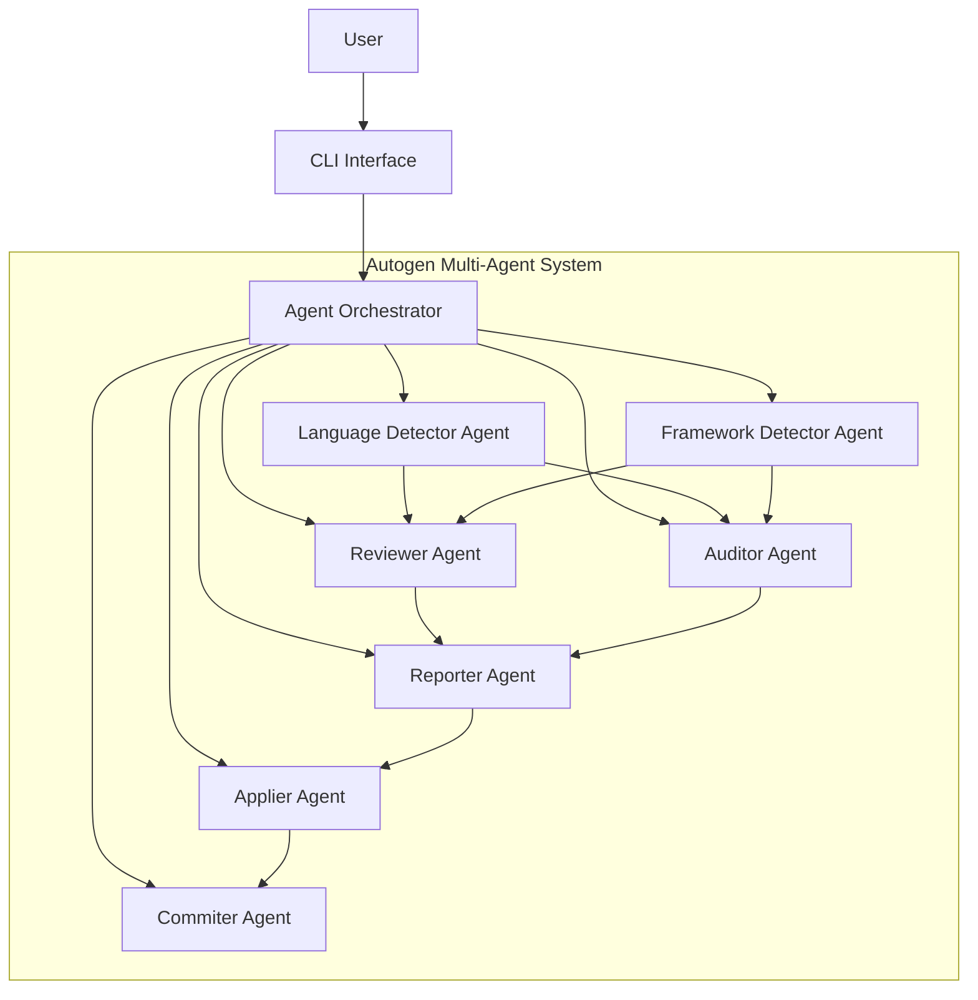

# Vaahai AI Integration

This document provides detailed information about the AI integration in Vaahai, focusing on how Microsoft's Autogen Framework is used to create a multi-agent system for code review and analysis.

## Autogen Framework Overview

Microsoft's Autogen Framework provides a foundation for building multi-agent systems where specialized agents can collaborate to solve complex tasks. In Vaahai, we leverage Autogen to create a system of specialized agents that work together to analyze, review, and improve code.

### Key Autogen Components Used

1. **AssistantAgent**: AI assistants with specific roles and expertise
2. **UserProxyAgent**: Agents that can execute code and perform actions
3. **GroupChat**: A mechanism for multiple agents to collaborate
4. **GroupChatManager**: Orchestrates conversations between agents

## Agent Architecture



## Agent Definitions

### Language Detector Agent

**Purpose**: Identify programming languages, estimate versions, and detect language features in code files.

**Implementation**:
```python
from vaahai.agents.base import VaahaiAgent
import autogen

class LanguageDetectorAgent(VaahaiAgent):
    def __init__(self, config, **kwargs):
        super().__init__(config, **kwargs)

        # Create Autogen assistant agent
        self.assistant = autogen.AssistantAgent(
            name="language_detector",
            system_message="""You are a language detection expert.
            Your task is to identify programming languages, estimate versions,
            and detect language features in code files.""",
            llm_config=self._get_llm_config()
        )

        # Create user proxy for executing code
        self.user_proxy = autogen.UserProxyAgent(
            name="language_detector_proxy",
            human_input_mode="NEVER",
            max_consecutive_auto_reply=10,
            code_execution_config={"work_dir": "workspace"}
        )

    def detect_file(self, file_path):
        """Detect language in a single file"""
        # Implementation using Autogen agents
        pass

    def detect_directory(self, dir_path):
        """Detect languages in a directory"""
        # Implementation using Autogen agents
        pass
```

### Framework Detector Agent

**Purpose**: Identify frameworks, libraries, and architectural patterns used in a project.

**Implementation**:
```python
from vaahai.agents.base import VaahaiAgent
import autogen

class FrameworkDetectorAgent(VaahaiAgent):
    def __init__(self, config, **kwargs):
        super().__init__(config, **kwargs)

        # Create Autogen assistant agent
        self.assistant = autogen.AssistantAgent(
            name="framework_detector",
            system_message="""You are a framework detection expert.
            Your task is to identify frameworks, libraries, and architectural
            patterns used in code projects.""",
            llm_config=self._get_llm_config()
        )

        # Create user proxy for executing code
        self.user_proxy = autogen.UserProxyAgent(
            name="framework_detector_proxy",
            human_input_mode="NEVER",
            max_consecutive_auto_reply=10,
            code_execution_config={"work_dir": "workspace"}
        )

    def detect(self, path):
        """Detect frameworks in a file or directory"""
        # Implementation using Autogen agents
        pass
```

### Reviewer Agent

**Purpose**: Perform code reviews focusing on quality, best practices, and potential bugs.

**Implementation**:
```python
from vaahai.agents.base import VaahaiAgent
import autogen

class ReviewerAgent(VaahaiAgent):
    def __init__(self, config, **kwargs):
        super().__init__(config, **kwargs)

        # Create Autogen assistant agent
        self.assistant = autogen.AssistantAgent(
            name="code_reviewer",
            system_message="""You are a code review expert.
            Your task is to review code for quality issues, adherence to best practices,
            potential bugs, and suggest improvements.""",
            llm_config=self._get_llm_config()
        )

        # Create user proxy for executing code
        self.user_proxy = autogen.UserProxyAgent(
            name="reviewer_proxy",
            human_input_mode="NEVER",
            max_consecutive_auto_reply=10,
            code_execution_config={"work_dir": "workspace"}
        )

    def review(self, path, focus="all", depth="standard"):
        """Review code in a file or directory"""
        # Implementation using Autogen agents
        pass
```

### Auditor Agent

**Purpose**: Perform comprehensive code audits for security, compliance, and performance.

**Implementation**:
```python
from vaahai.agents.base import VaahaiAgent
import autogen

class AuditorAgent(VaahaiAgent):
    def __init__(self, config, **kwargs):
        super().__init__(config, **kwargs)

        # Create Autogen assistant agent
        self.assistant = autogen.AssistantAgent(
            name="code_auditor",
            system_message="""You are a code audit expert.
            Your task is to audit code for security vulnerabilities, compliance issues,
            performance bottlenecks, and architectural flaws.""",
            llm_config=self._get_llm_config()
        )

        # Create user proxy for executing code
        self.user_proxy = autogen.UserProxyAgent(
            name="auditor_proxy",
            human_input_mode="NEVER",
            max_consecutive_auto_reply=10,
            code_execution_config={"work_dir": "workspace"}
        )

    def audit(self, path, focus=None, standards=None):
        """Audit code in a file or directory"""
        # Implementation using Autogen agents
        pass
```

### Reporter Agent

**Purpose**: Format and present findings in various output formats.

**Implementation**:
```python
from vaahai.agents.base import VaahaiAgent
import autogen

class ReporterAgent(VaahaiAgent):
    def __init__(self, config, **kwargs):
        super().__init__(config, **kwargs)

        # Create Autogen assistant agent
        self.assistant = autogen.AssistantAgent(
            name="reporter",
            system_message="""You are a reporting expert.
            Your task is to format and present code analysis findings in a clear,
            organized, and actionable manner.""",
            llm_config=self._get_llm_config()
        )

        # Create user proxy for executing code
        self.user_proxy = autogen.UserProxyAgent(
            name="reporter_proxy",
            human_input_mode="NEVER",
            max_consecutive_auto_reply=10,
            code_execution_config={"work_dir": "workspace"}
        )

    def generate(self, data, format="terminal"):
        """Generate a report from analysis data"""
        # Implementation using Autogen agents
        pass
```

## Multi-Agent Collaboration

### Group Chat Setup

```python
from vaahai.agents import AgentFactory
import autogen

def create_review_group_chat(config, path):
    """Create a group chat for code review"""

    # Create agents
    language_detector = AgentFactory.create("language_detector", config)
    framework_detector = AgentFactory.create("framework_detector", config)
    reviewer = AgentFactory.create("reviewer", config)
    reporter = AgentFactory.create("reporter", config)

    # Create group chat
    group_chat = autogen.GroupChat(
        agents=[
            language_detector.assistant,
            framework_detector.assistant,
            reviewer.assistant,
            reporter.assistant
        ],
        messages=[],
        max_round=10
    )

    # Create group chat manager
    manager = autogen.GroupChatManager(group_chat=group_chat)

    return manager
```

### Conversation Flow

A typical conversation flow between agents might look like this:

1. **Orchestrator**: "Review the code in /path/to/project"
2. **Language Detector**: "I'll analyze the code to identify languages."
3. **Language Detector**: "The project contains Python (80%), JavaScript (15%), and HTML/CSS (5%)."
4. **Framework Detector**: "Based on the file structure and imports, this appears to be a Django project with React frontend."
5. **Reviewer**: "I'll review the code focusing on Python and Django best practices."
6. **Reviewer**: "I've found several issues: [list of issues]"
7. **Reporter**: "Here's a formatted report of the findings: [formatted report]"

## LLM Integration

### LLM Configuration

```python
def _get_llm_config(self):
    """Get LLM configuration based on user settings"""
    provider = self.config.get("llm.provider", "openai")

    if provider == "openai":
        return {
            "config_list": [{
                "model": self.config.get("openai.model", "gpt-4"),
                "api_key": self.config.get("openai.api_key")
            }]
        }
    elif provider == "claude":
        return {
            "config_list": [{
                "model": self.config.get("claude.model", "claude-2"),
                "api_key": self.config.get("claude.api_key")
            }]
        }
    elif provider == "ollama":
        return {
            "config_list": [{
                "model": self.config.get("ollama.model", "llama2"),
                "api_base": self.config.get("ollama.api_base", "http://localhost:11434")
            }]
        }
    else:
        raise ValueError(f"Unsupported LLM provider: {provider}")
```

### Prompt Templates

Vaahai uses carefully crafted prompt templates for different agent tasks. Here's an example for the Language Detector:

```python
LANGUAGE_DETECTION_PROMPT = """
Analyze the following code and identify:
1. The programming language(s) used
2. The likely version or version range of the language
3. Key language features or paradigms used
4. Confidence level in your detection (0-1)

Code to analyze:
{code}

Respond in JSON format:
{{
  "language": "language_name",
  "version": "version_range",
  "features": ["feature1", "feature2", ...],
  "confidence": 0.95
}}
"""
```

## Docker-based Code Execution

For secure code execution, Vaahai uses Docker containers:

```python
class DockerExecutor:
    def __init__(self, config):
        self.config = config
        self.client = docker.from_env()

    def execute(self, code, language):
        """Execute code in a Docker container"""
        container_image = self._get_container_image(language)

        # Create container with resource limits
        container = self.client.containers.run(
            container_image,
            command=["python", "-c", code] if language == "python" else [...],
            detach=True,
            mem_limit="512m",
            cpu_quota=50000,  # 50% of CPU
            network_mode="none",  # No network access
            remove=True
        )

        # Get output with timeout
        try:
            output = container.logs(stdout=True, stderr=True, timeout=10)
            return {"success": True, "output": output.decode("utf-8")}
        except Exception as e:
            return {"success": False, "error": str(e)}
        finally:
            try:
                container.stop(timeout=1)
            except:
                pass
```

## Agent Configuration

Agents can be configured through the Vaahai configuration system:

```toml
# Example agent configuration in .vaahai.toml

[agents]
# Global agent settings
timeout = 60
max_tokens = 4000

[agents.language_detector]
confidence_threshold = 0.8
use_content_analysis = true

[agents.reviewer]
focus = "quality"
depth = "standard"
include_code_snippets = true

[agents.reporter]
format = "markdown"
include_summary = true
include_recommendations = true
```

## Extension Points

The AI integration is designed to be extensible in several ways:

1. **New Agents**: Create new agent classes that inherit from `VaahaiAgent`
2. **Custom Prompts**: Define custom prompts for specialized tasks
3. **LLM Providers**: Add support for additional LLM providers
4. **Analysis Tools**: Integrate with additional static analysis tools
5. **Output Formats**: Add new output formatters for different presentation needs

## Performance Considerations

To optimize performance and manage costs:

1. **Caching**: Cache LLM responses for similar inputs
2. **Batching**: Process multiple files in batches
3. **Sampling**: For large codebases, analyze a representative sample
4. **Local LLMs**: Use Ollama for cost-sensitive operations
5. **Parallelization**: Run independent agent tasks concurrently
