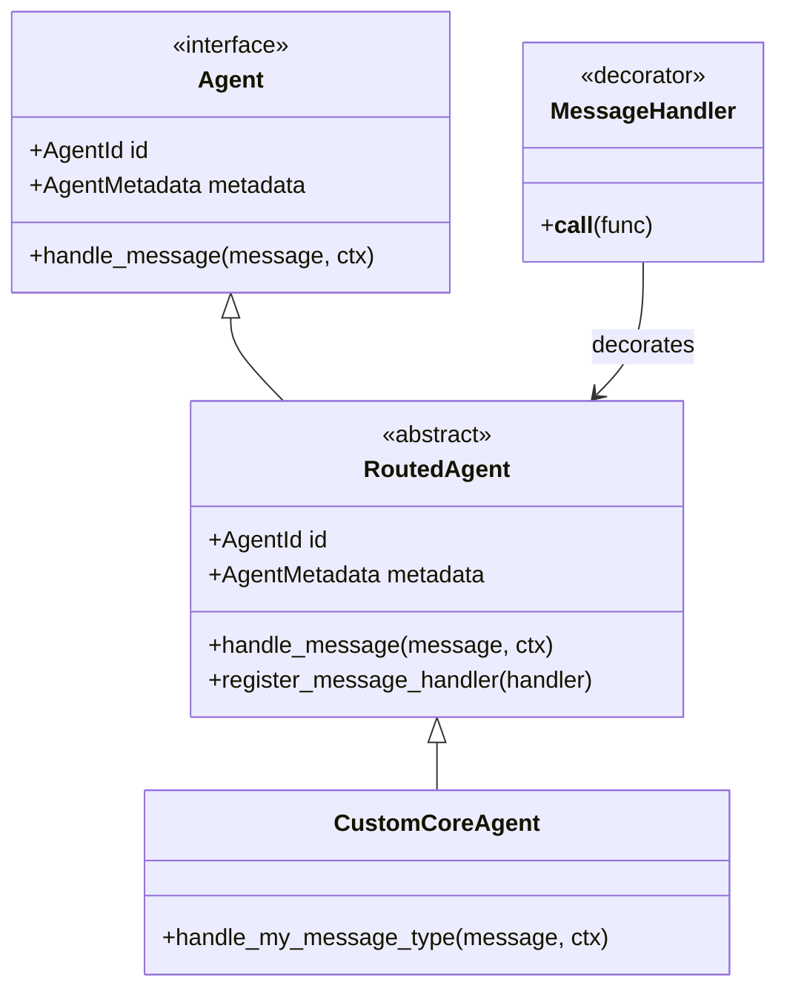
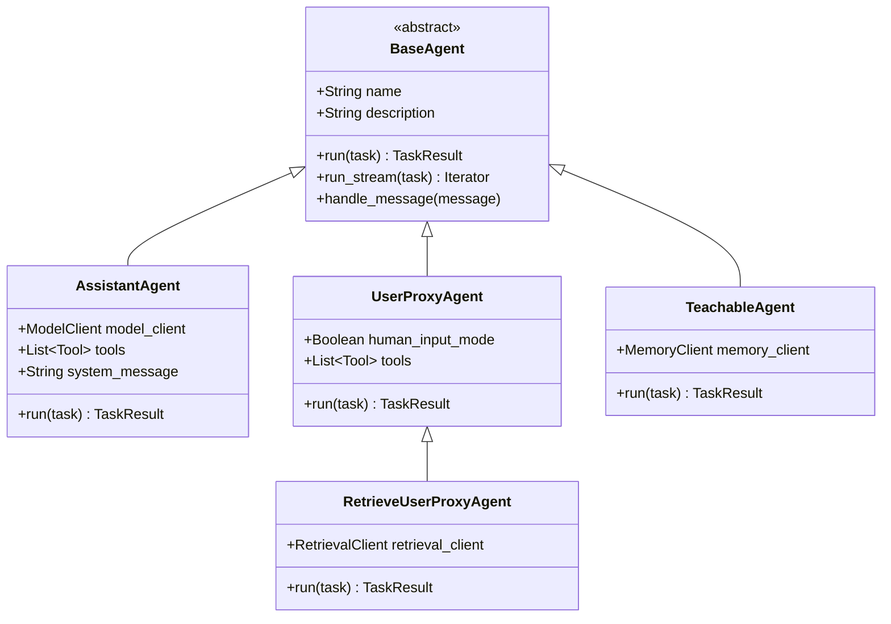
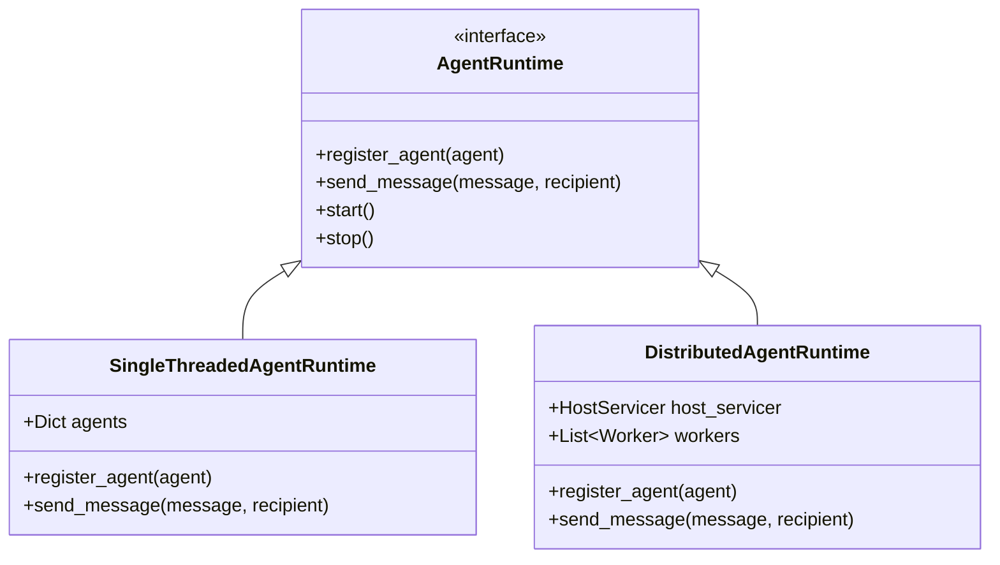
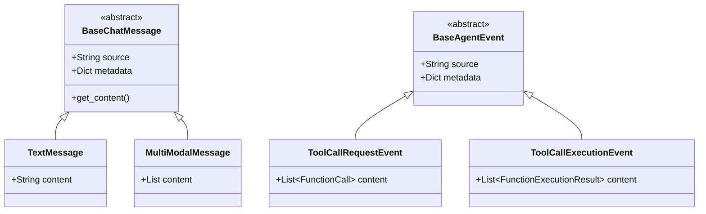
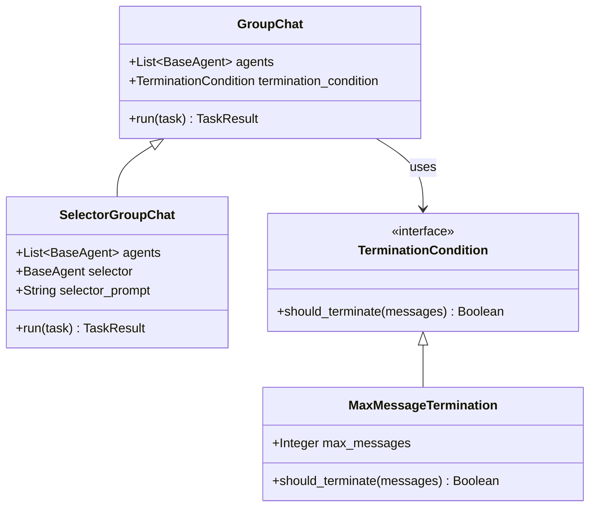

# Autogen Agent Class Hierarchy

This document provides a detailed view of the class hierarchy in Microsoft Autogen's agent architecture, focusing on inheritance relationships and key components.

## Core API Class Hierarchy

## AgentChat Class Hierarchy

## Runtime Environment Classes

## Message Classes

## Group Chat Classes

## Key Relationships

1. **Agent Inheritance**: All agents inherit from either the `Agent` interface in Core API or the `BaseAgent` class in AgentChat.

2. **Message Handling**: Agents process messages through handler methods, which can be registered using the `@message_handler` decorator in Core API.

3. **Runtime Management**: The agent runtime manages agent lifecycles and facilitates communication between agents.

4. **Group Coordination**: Group chat classes orchestrate conversations between multiple agents, with optional selection logic.

5. **Termination Logic**: Termination conditions determine when a conversation should end based on various criteria.

This class hierarchy demonstrates the extensible nature of Autogen's architecture, allowing for custom agent implementations while maintaining a consistent interface for communication and management.
