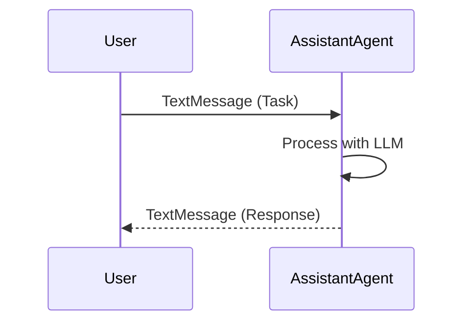
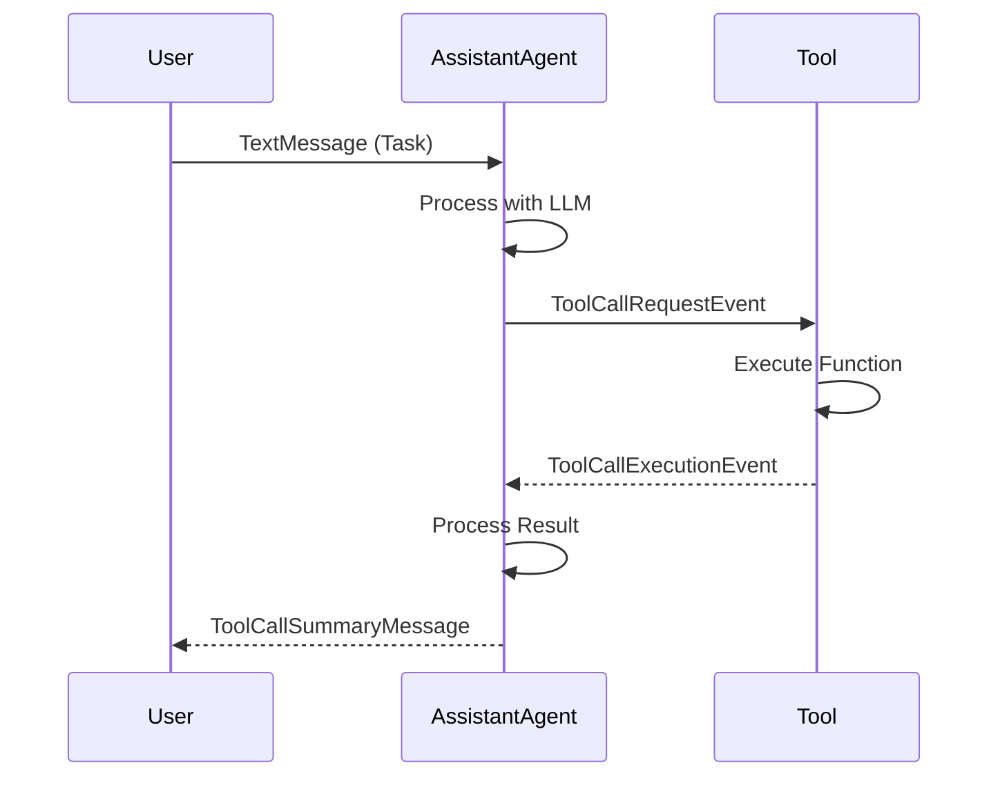
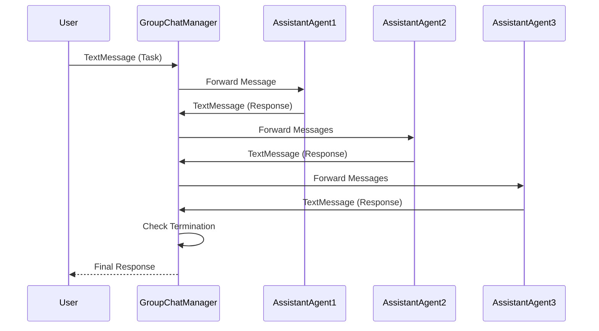
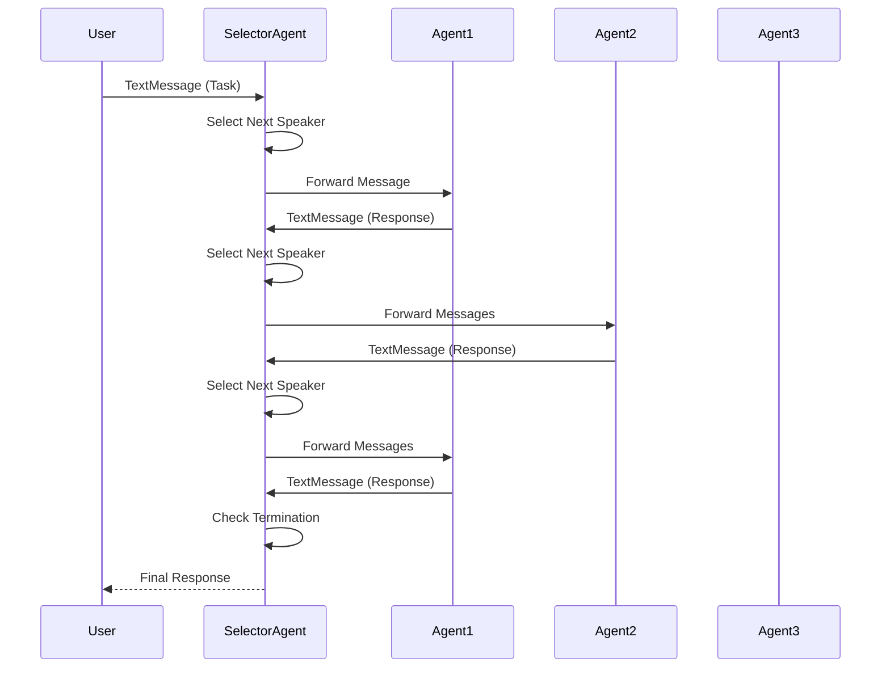
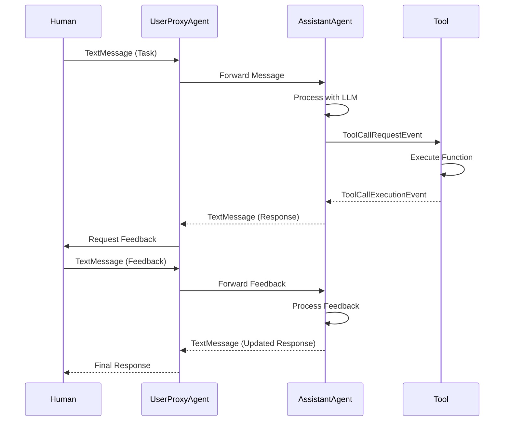
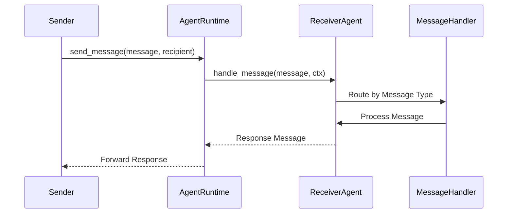
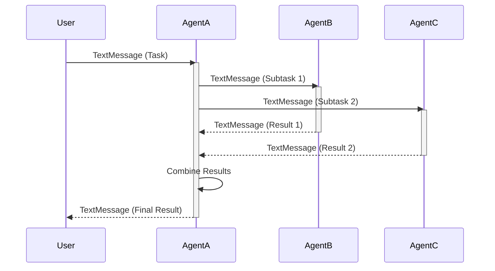
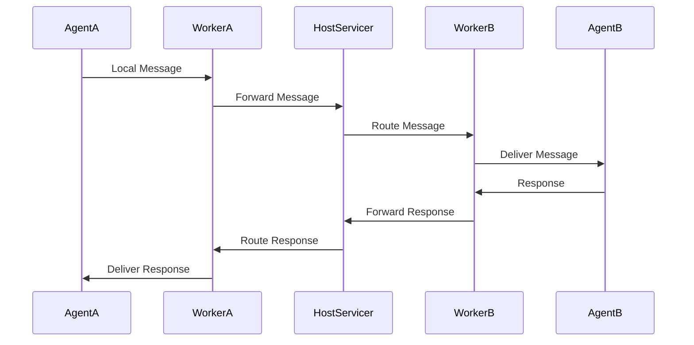

# Autogen Agent Communication Flow

This document illustrates the communication patterns and message flow between agents in Microsoft Autogen's architecture. Understanding these patterns is crucial for implementing effective multi-agent systems in VaahAI.

## Basic Agent Communication

## Tool Usage Flow

## Multi-Agent Conversation (Group Chat)

## Selector Group Chat

## Human-in-the-Loop Flow

## Core API Message Routing

## Asynchronous Communication Pattern

## Message Flow in Distributed Runtime

## Key Communication Patterns

1. **Direct Communication**: One-to-one messaging between agents
2. **Group Chat**: Multiple agents participating in a conversation
3. **Selector-Based**: A moderator agent selects the next speaker
4. **Human-in-the-Loop**: Human feedback integrated into agent workflows
5. **Tool-Based**: Agents using tools to perform actions
6. **Asynchronous**: Agents working on tasks in parallel
7. **Distributed**: Communication across process or machine boundaries

These communication patterns form the foundation of Autogen's flexible architecture, enabling complex multi-agent workflows while maintaining a consistent messaging interface.
