# Autogen Conversation Pattern Diagrams

This document provides visual representations of the various conversation patterns supported by Microsoft Autogen. These diagrams illustrate the message flow and interaction patterns between agents.

## Basic Request-Response Pattern

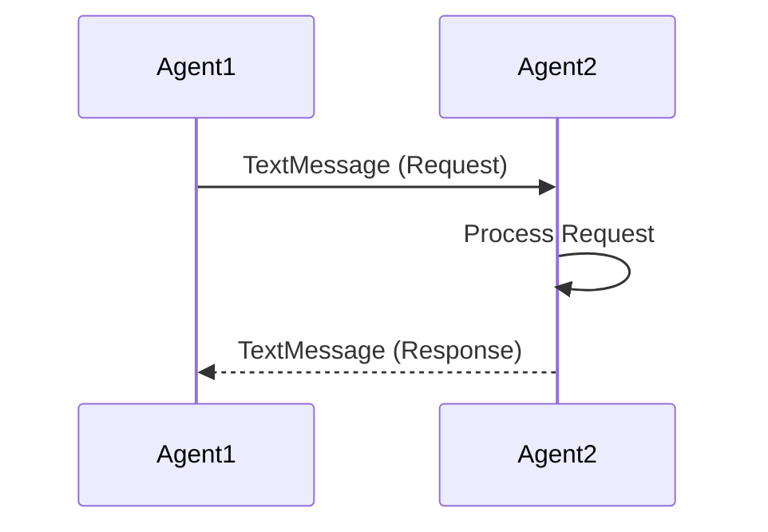

## Streaming Response Pattern

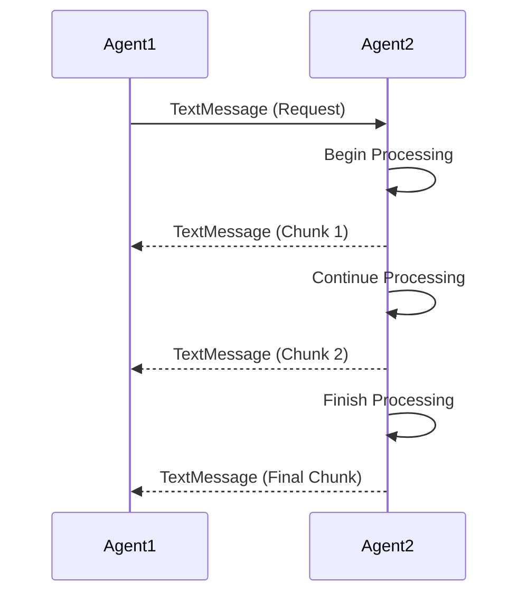

## Human-in-the-Loop Approval Flow

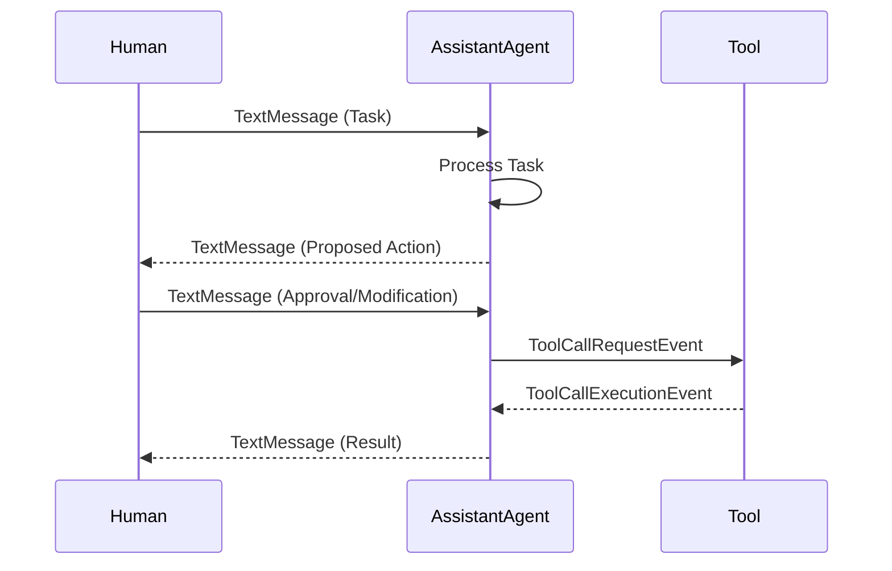

## Round-Robin Group Chat

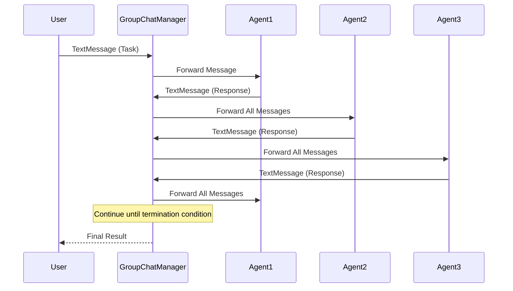

## Selector-Based Chat

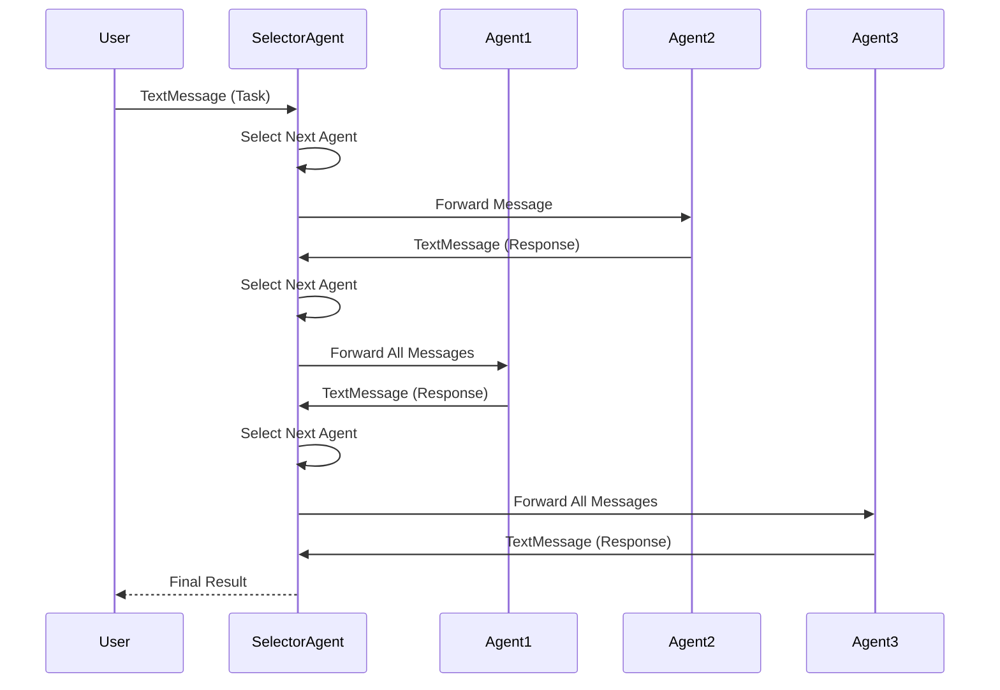

## Tool Usage Flow

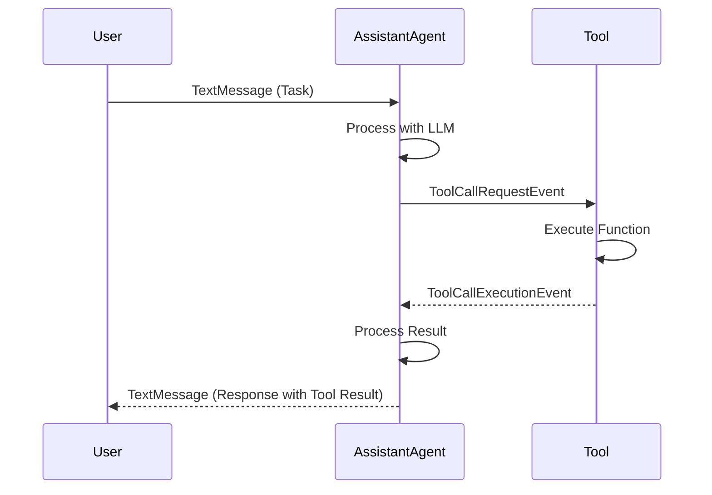

## Multi-Step Tool Usage

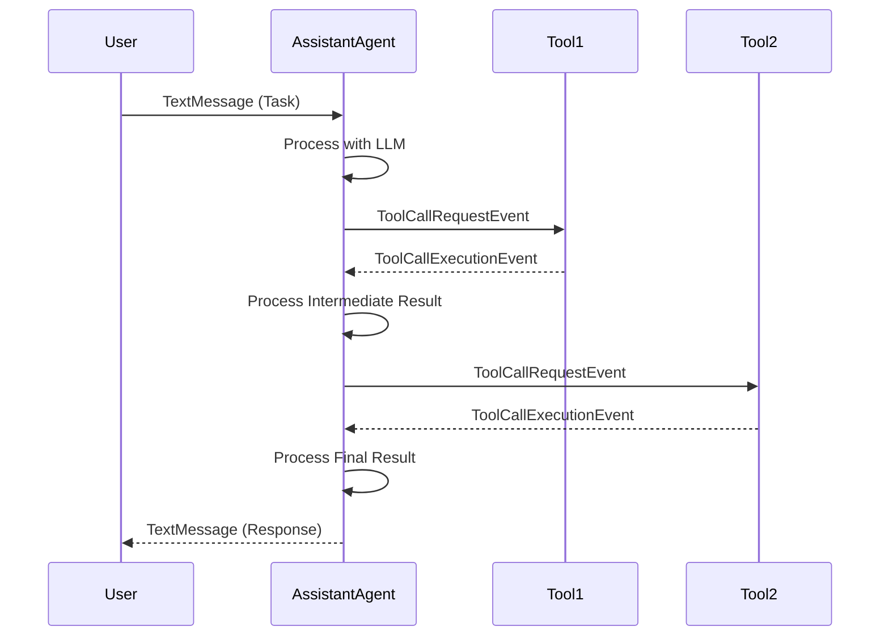

## Asynchronous Communication

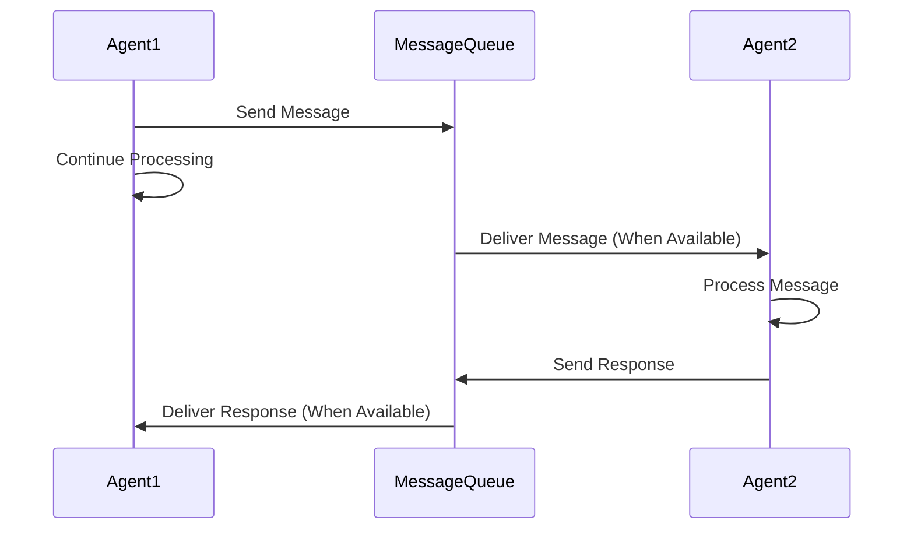

## Distributed Communication

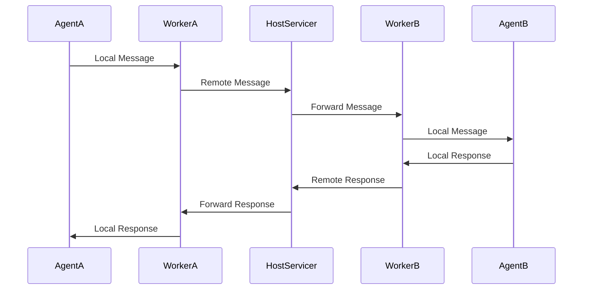

## Termination Conditions

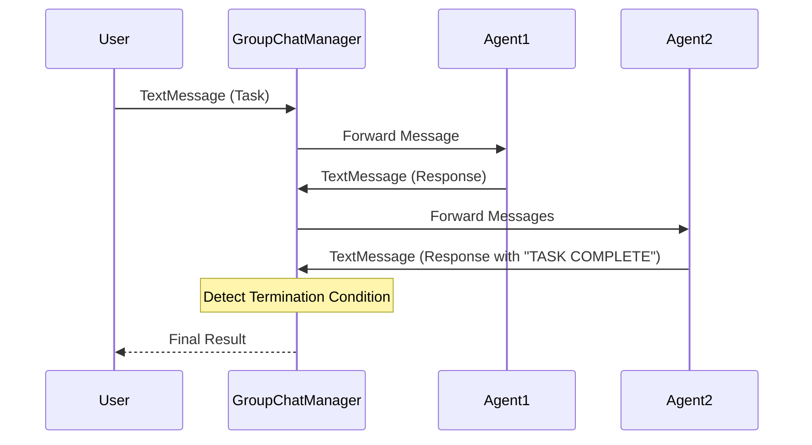

## Human Feedback Loop

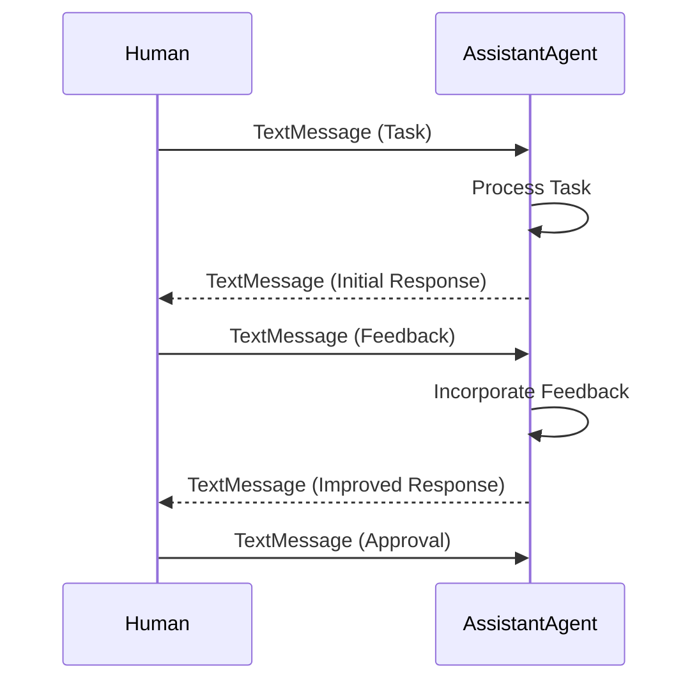

## Broadcast Communication

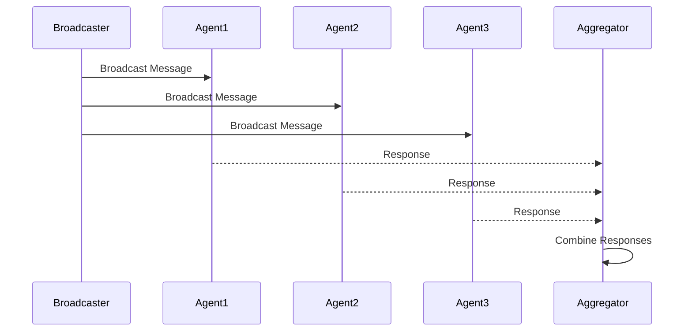
