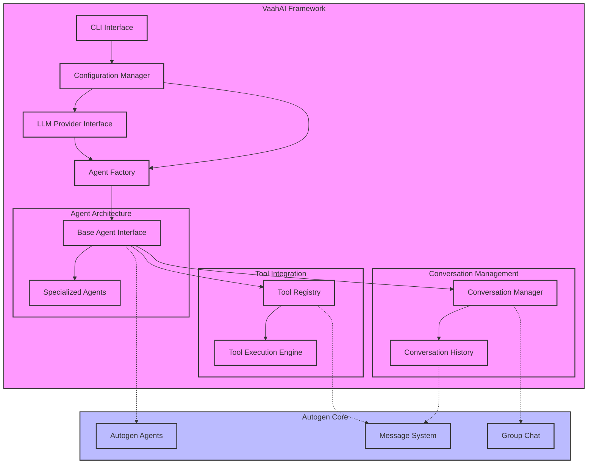
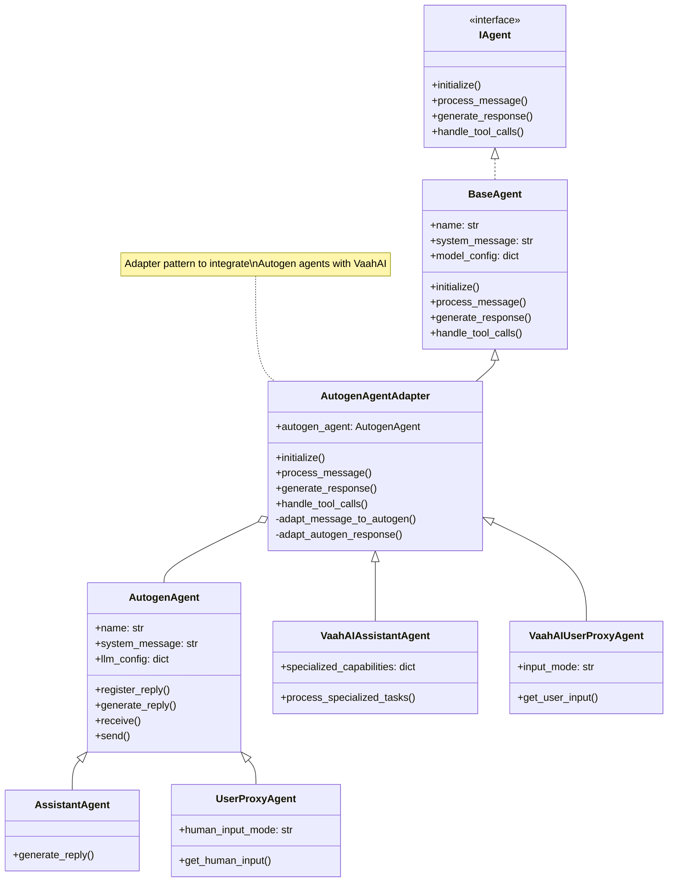
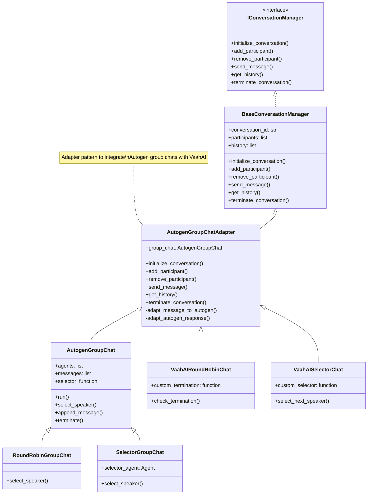
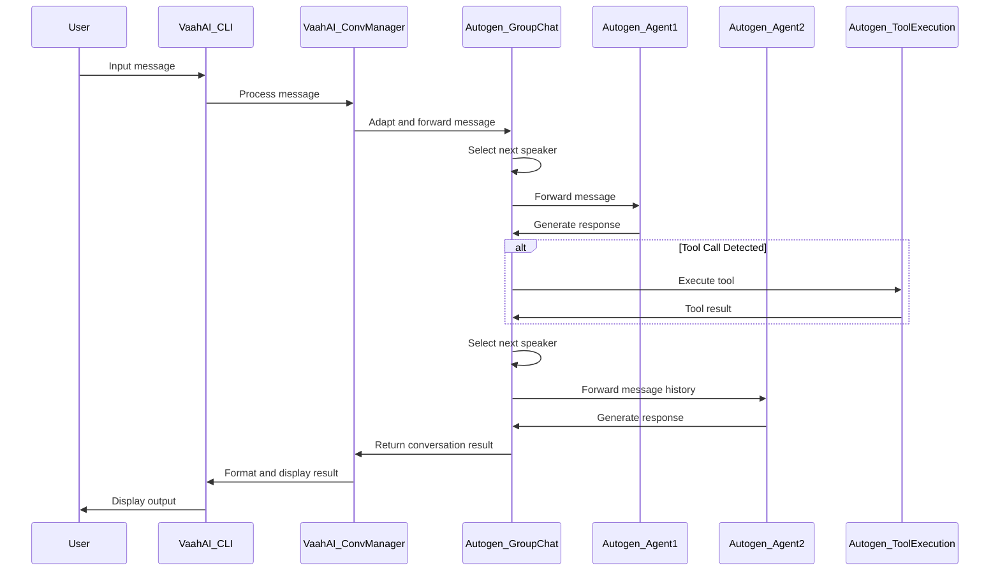
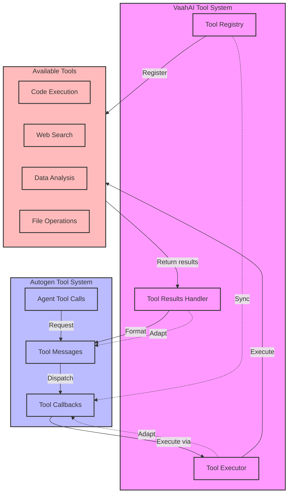
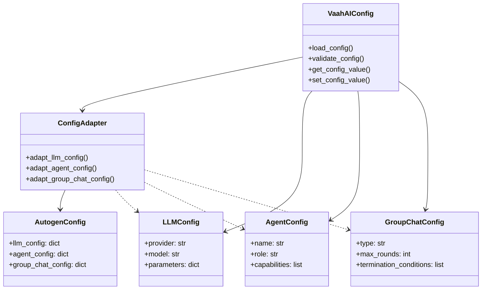
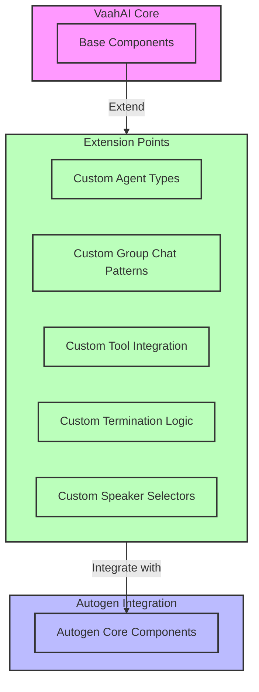

# Autogen Integration Architecture

This document contains architecture diagrams illustrating how Microsoft Autogen components will integrate with VaahAI. These diagrams provide a visual representation of the integration approach, component relationships, and data flows.

## Table of Contents
1. [High-Level Integration Architecture](#high-level-integration-architecture)
2. [Agent Integration Layer](#agent-integration-layer)
3. [Group Chat Integration](#group-chat-integration)
4. [Message Flow Architecture](#message-flow-architecture)
5. [Tool Integration Architecture](#tool-integration-architecture)
6. [Configuration Integration](#configuration-integration)
7. [Extension Points](#extension-points)

## High-Level Integration Architecture

This diagram shows the high-level architecture of VaahAI with Autogen integration, illustrating the major components and their relationships.

## Agent Integration Layer

This diagram illustrates how VaahAI's agent architecture integrates with Autogen's agent system.

## Group Chat Integration

This diagram shows how VaahAI's conversation management integrates with Autogen's group chat functionality.

## Message Flow Architecture

This diagram illustrates the flow of messages between VaahAI and Autogen components.

## Tool Integration Architecture

This diagram shows how VaahAI's tool system integrates with Autogen's tool calling capabilities.

## Configuration Integration

This diagram illustrates how VaahAI's configuration system integrates with Autogen's configuration requirements.

## Extension Points

This diagram highlights the extension points in the integration architecture that allow for customization and enhancement.

These diagrams provide a comprehensive visual representation of how Microsoft Autogen components will integrate with VaahAI, highlighting the key architectural components, relationships, and extension points.
