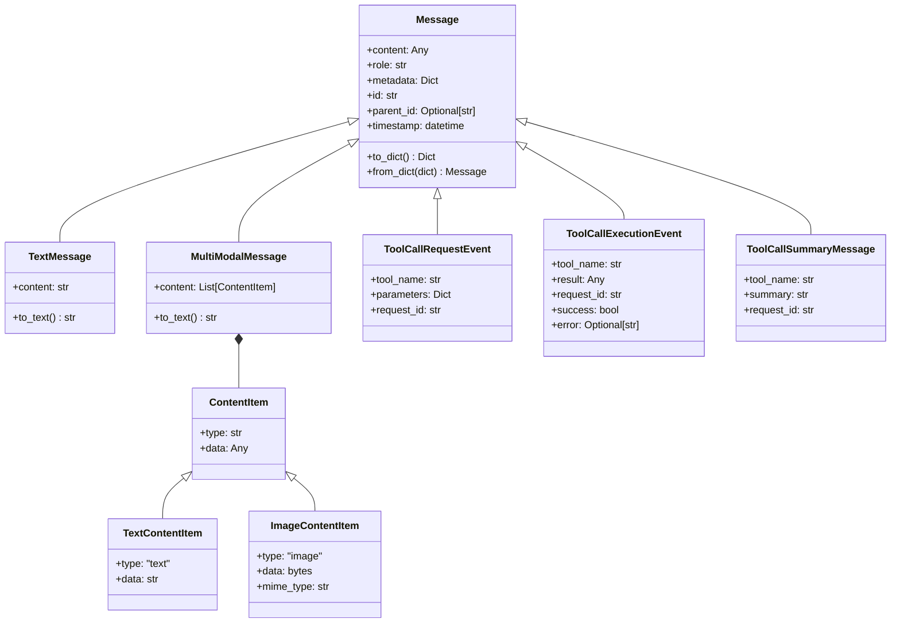
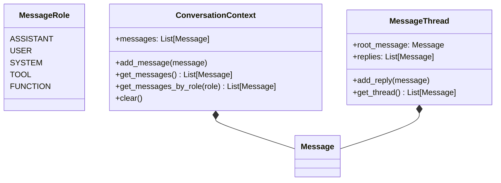
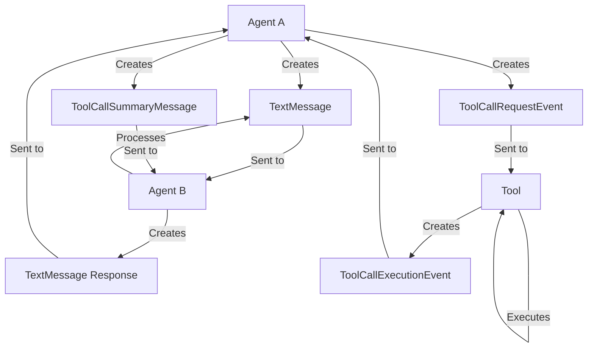
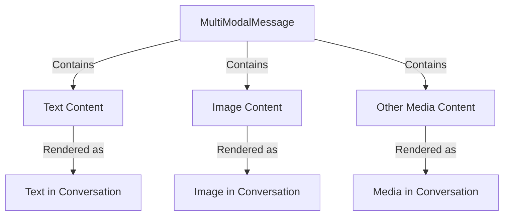
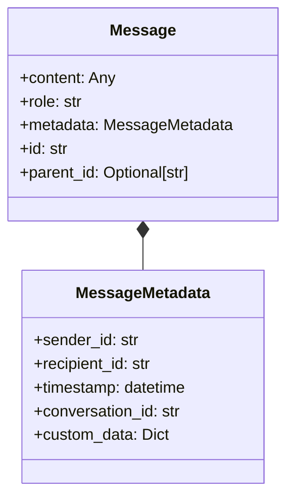
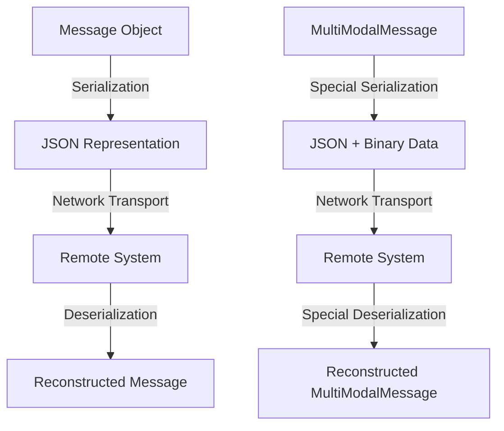
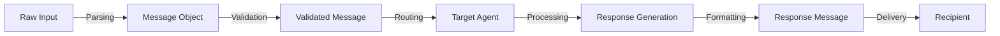
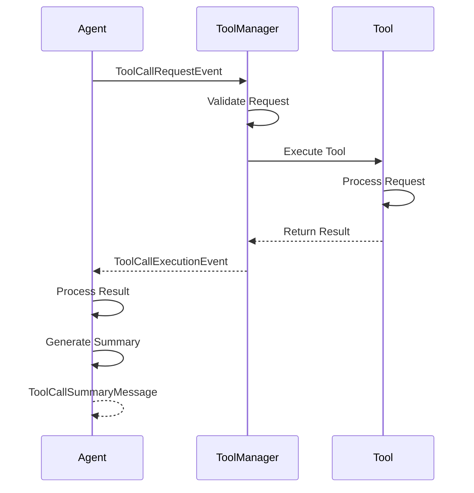

# Autogen Message Types

This document provides visual representations of the various message types used in Microsoft Autogen's framework. Understanding these message types is essential for implementing effective agent communication in VaahAI.

## Core Message Type Hierarchy

## Message Roles and Context

## Message Flow in Agent Communication

## MultiModal Message Structure

## Message Metadata Structure

## Message Serialization and Transport

## Message Processing Pipeline

## Tool Message Flow

