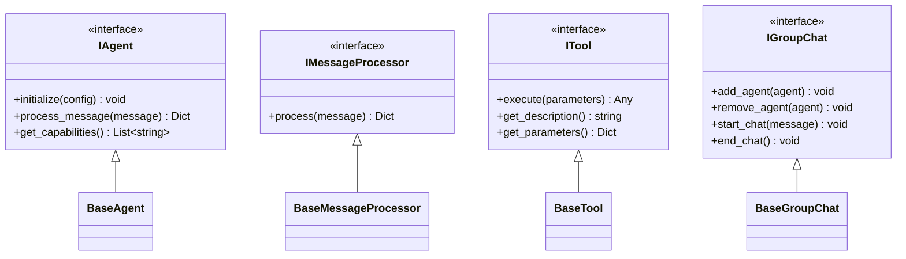
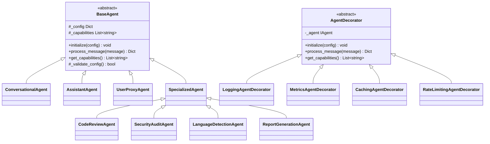
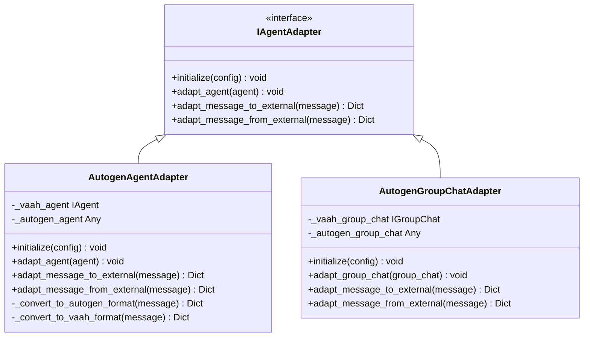
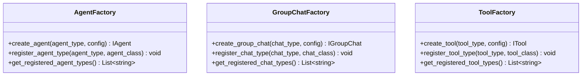
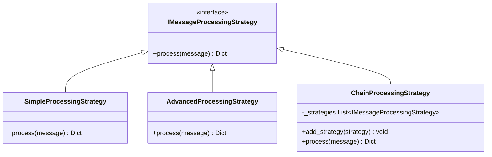
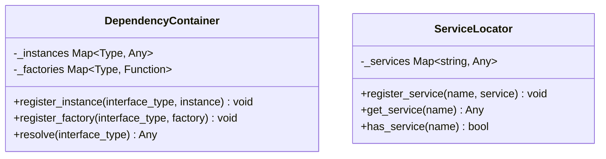
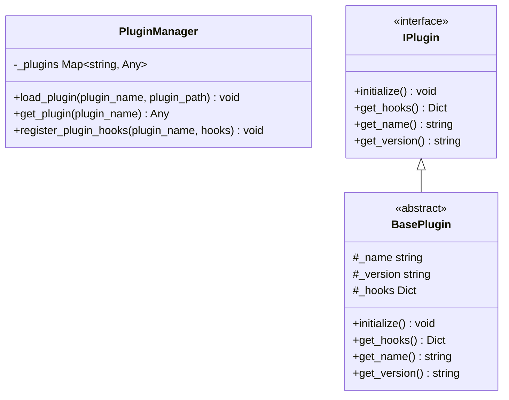
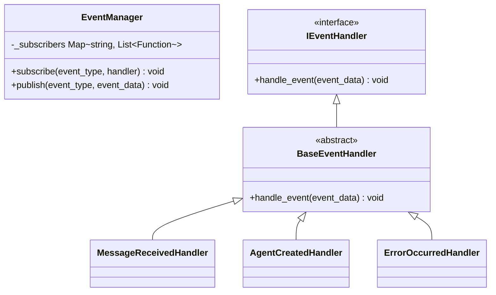
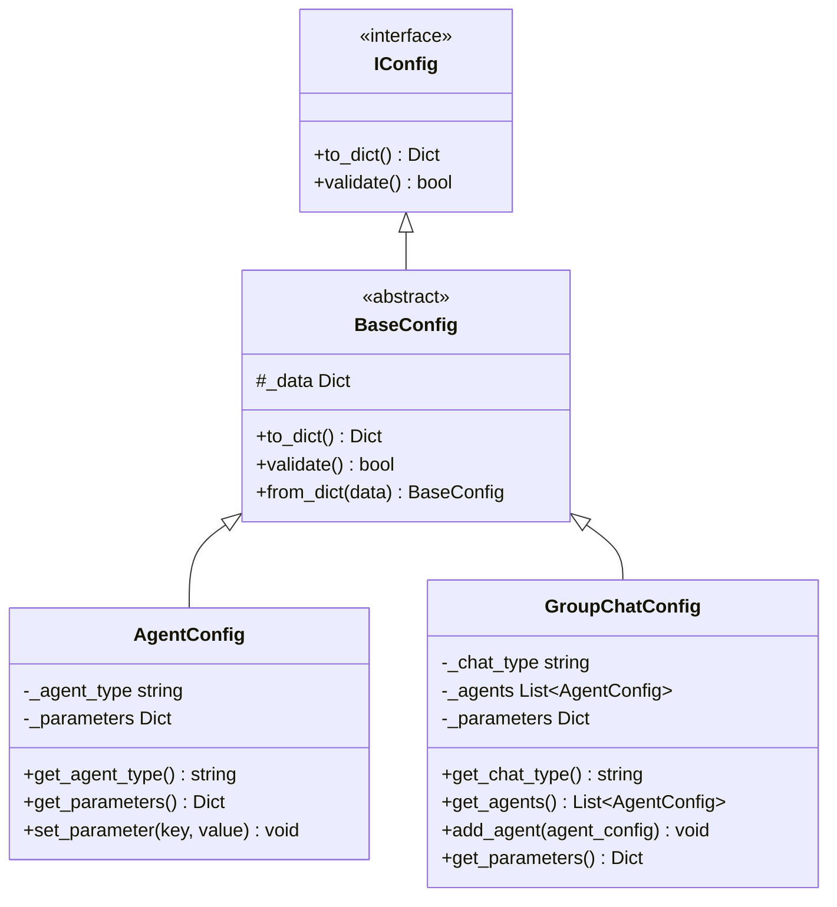

# VaahAI Custom Agent Class Hierarchy

This document provides a detailed view of the class hierarchy in VaahAI's custom agent architecture, focusing on reusability and extensibility.

## Core Interface Hierarchy

## Agent Implementation Hierarchy

## Adapter Layer

## Factory Pattern Implementation

## Strategy Pattern Implementation

## Dependency Injection System

## Plugin System

## Event System

## Configuration System

## Reusability and Extensibility Features

This class hierarchy emphasizes reusability and extensibility through:

1. **Interface-Based Design**: All components are defined through interfaces
2. **Decorator Pattern**: For dynamically adding capabilities to agents
3. **Strategy Pattern**: For swappable message processing algorithms
4. **Adapter Pattern**: For clean integration with Autogen
5. **Factory Pattern**: For flexible object creation
6. **Dependency Injection**: For flexible component composition
7. **Plugin System**: For dynamically loading new functionality
8. **Event System**: For extensible event handling
9. **Configuration System**: For separating configuration from implementation

These patterns work together to create a highly reusable and extensible agent architecture that can adapt to changing requirements while maintaining a clean separation between VaahAI and Autogen components.
