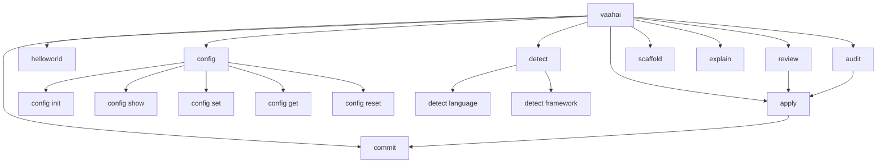

# Vaahai Command Reference

This document provides a comprehensive reference for all available Vaahai commands, their options, and examples of usage.

## Command Structure

Vaahai commands follow this general structure:

```
vaahai [command] [subcommand] [options] [arguments]
```

## Global Options

These options can be used with any command:

| Option | Description |
|--------|-------------|
| `--help`, `-h` | Show help message and exit |
| `--version`, `-v` | Show version information |
| `--debug` | Enable debug output |
| `--quiet`, `-q` | Suppress non-error output |
| `--config FILE` | Use a specific configuration file |

## Available Commands

### `config`

Manage Vaahai configuration.

#### Subcommands

| Subcommand | Description |
|------------|-------------|
| `init` | Initialize or update configuration |
| `show` | Display current configuration |
| `set` | Set a configuration value |
| `get` | Get a configuration value |
| `reset` | Reset configuration to defaults |

#### Examples

```bash
# Initialize configuration
vaahai config init

# Show current configuration
vaahai config show

# Set a configuration value
vaahai config set openai.api_key sk-your-api-key

# Get a configuration value
vaahai config get llm.provider

# Reset configuration
vaahai config reset
```

### `helloworld`

Test your Vaahai installation and LLM connection.

#### Options

| Option | Description |
|--------|-------------|
| `--name TEXT` | Name to include in the greeting |

#### Examples

```bash
# Basic hello world
vaahai helloworld

# Personalized hello world
vaahai helloworld --name "Alice"
```

### `review`

Review code for quality, best practices, and potential issues.

#### Options

| Option | Description | Default |
|--------|-------------|---------|
| `--output`, `-o` | Output format (terminal, markdown, html) | `terminal` |
| `--depth`, `-d` | Review depth (quick, standard, deep) | `standard` |
| `--focus`, `-f` | Focus areas (quality, security, performance, all) | `all` |
| `--save`, `-s` | Save output to file | None |
| `--exclude` | Patterns to exclude (comma-separated) | None |
| `--include` | Patterns to include (comma-separated) | None |
| `--use-docker` | Use Docker for code execution | Config default |
| `--template` | Custom output template | None |
| `--interactive`, `-i` | Interactive mode | `False` |

#### Examples

```bash
# Review a single file
vaahai review path/to/file.py

# Review a directory with specific focus
vaahai review path/to/project/ --focus security

# Deep review with markdown output
vaahai review path/to/file.py --depth deep --output markdown --save review.md

# Review with file filtering
vaahai review path/to/project/ --exclude "node_modules,*.log" --include "*.py,*.js"
```

### `audit`

Perform a comprehensive code audit for security, compliance, and more.

#### Options

| Option | Description | Default |
|--------|-------------|---------|
| `--output`, `-o` | Output format (terminal, markdown, html) | `terminal` |
| `--depth`, `-d` | Audit depth (standard, deep) | `deep` |
| `--focus`, `-f` | Focus areas (security, compliance, performance, architecture, all) | `all` |
| `--standards`, `-s` | Compliance standards to check (comma-separated) | None |
| `--save` | Save output to file | None |
| `--exclude` | Patterns to exclude (comma-separated) | None |
| `--include` | Patterns to include (comma-separated) | None |
| `--use-docker` | Use Docker for code execution | Config default |
| `--template` | Custom output template | None |

#### Examples

```bash
# Audit a project
vaahai audit path/to/project/

# Security-focused audit
vaahai audit path/to/project/ --focus security

# Audit with specific compliance standards
vaahai audit path/to/project/ --standards owasp-top-10,pci-dss

# Comprehensive audit with HTML report
vaahai audit path/to/project/ --depth deep --output html --save audit-report.html
```

### `apply`

Apply suggested changes from a review or audit.

#### Options

| Option | Description | Default |
|--------|-------------|---------|
| `--interactive`, `-i` | Review each change before applying | `True` |
| `--backup`, `-b` | Create backups of modified files | `True` |
| `--dry-run` | Show changes without applying them | `False` |
| `--force`, `-f` | Apply changes without confirmation | `False` |

#### Examples

```bash
# Apply changes from a review file
vaahai apply path/to/review.md

# Apply changes with interactive confirmation
vaahai apply path/to/review.md --interactive

# Show changes without applying
vaahai apply path/to/review.md --dry-run

# Apply changes without confirmation (use with caution)
vaahai apply path/to/review.md --force --no-backup
```

### `commit`

Commit applied changes to Git.

#### Options

| Option | Description | Default |
|--------|-------------|---------|
| `--message`, `-m` | Commit message | Auto-generated |
| `--push`, `-p` | Push changes after commit | `False` |
| `--branch`, `-b` | Create and use a new branch | None |

#### Examples

```bash
# Commit with default message
vaahai commit

# Commit with custom message
vaahai commit --message "Fix security issues"

# Commit and push to remote
vaahai commit --push

# Commit to a new branch
vaahai commit --branch fix-security-issues
```

### `detect`

Detect programming languages and frameworks in a project.

#### Subcommands

| Subcommand | Description |
|------------|-------------|
| `language` | Detect programming languages |
| `framework` | Detect frameworks and libraries |

#### Options

| Option | Description | Default |
|--------|-------------|---------|
| `--output`, `-o` | Output format (terminal, markdown, html, json) | `terminal` |
| `--save`, `-s` | Save output to file | None |

#### Examples

```bash
# Detect languages in a project
vaahai detect language path/to/project/

# Detect frameworks with JSON output
vaahai detect framework path/to/project/ --output json

# Save detection results to file
vaahai detect language path/to/project/ --output markdown --save languages.md
```

### `scaffold`

Generate code scaffolding based on specifications.

#### Options

| Option | Description | Default |
|--------|-------------|---------|
| `--type`, `-t` | Scaffolding type (project, component, test) | None |
| `--language`, `-l` | Programming language | None |
| `--framework`, `-f` | Framework or library | None |
| `--interactive`, `-i` | Interactive mode | `True` |
| `--output-dir`, `-o` | Output directory | Current directory |

#### Examples

```bash
# Scaffold a new project interactively
vaahai scaffold --type project

# Scaffold a React component
vaahai scaffold --type component --language javascript --framework react

# Scaffold tests for a Python file
vaahai scaffold --type test --language python path/to/file.py
```

### `explain`

Explain code functionality and structure.

#### Options

| Option | Description | Default |
|--------|-------------|---------|
| `--output`, `-o` | Output format (terminal, markdown, html) | `terminal` |
| `--depth`, `-d` | Explanation depth (brief, standard, detailed) | `standard` |
| `--save`, `-s` | Save output to file | None |

#### Examples

```bash
# Explain a file
vaahai explain path/to/file.py

# Detailed explanation with markdown output
vaahai explain path/to/file.py --depth detailed --output markdown --save explanation.md
```

## Command Relationships



## Exit Codes

| Code | Description |
|------|-------------|
| 0 | Success |
| 1 | General error |
| 2 | Configuration error |
| 3 | Input error |
| 4 | API error |
| 5 | Permission error |

## Environment Variables

All configuration options can be set using environment variables with the `VAAHAI_` prefix and uppercase, underscore-separated keys:

```bash
# Set LLM provider
export VAAHAI_LLM_PROVIDER=openai

# Set API key
export VAAHAI_OPENAI_API_KEY=your-api-key-here

# Set model
export VAAHAI_OPENAI_MODEL=gpt-4
```
