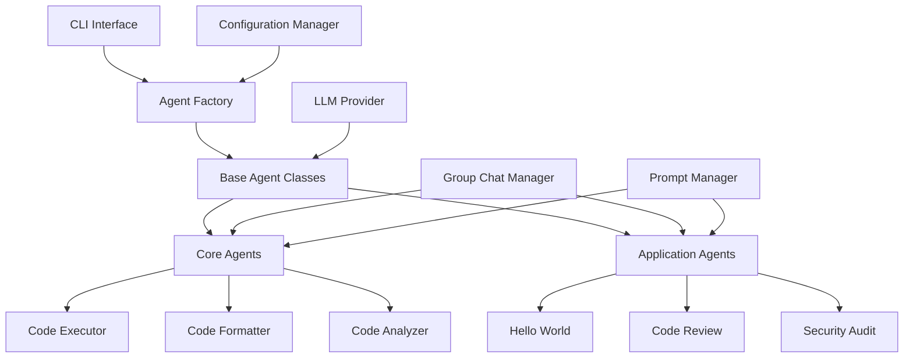

# VaahAI Agent Architecture

## Overview

VaahAI utilizes Microsoft's AutoGen framework to implement a multi-agent AI system that can perform complex tasks through agent collaboration. This document describes the agent architecture, component interactions, and extension patterns.

## Architecture Diagram



## Agent Hierarchy

VaahAI implements a hierarchical agent architecture with three main layers:

1. **Base Agents**: Abstract classes and interfaces that define the agent contract
2. **Core Agents**: Reusable agents that perform fundamental tasks
3. **Application Agents**: Purpose-specific agents that solve particular problems

### Base Agent Classes

The foundation of the agent architecture is the `AgentBase` abstract class, which defines the common interface and lifecycle for all agents:

```python
class AgentBase(ABC):
    """Abstract base class for all VaahAI agents."""
    
    def __init__(self, config: Dict[str, Any]):
        self.config = config
        self.name = self.__class__.__name__
        self.initialize()
    
    def initialize(self) -> None:
        """Initialize agent resources."""
        pass
    
    @abstractmethod
    def run(self, *args, **kwargs) -> Any:
        """Run the agent with the given inputs."""
        pass
    
    def cleanup(self) -> None:
        """Clean up any resources used by the agent."""
        pass
```

The `AutoGenAgentBase` extends this with AutoGen-specific functionality:

```python
class AutoGenAgentBase(AgentBase):
    """Base class for AutoGen-based agents."""
    
    def __init__(self, config: Dict[str, Any]):
        super().__init__(config)
        self.llm_config = self._prepare_llm_config()
        self.agent = self._create_autogen_agent()
```

### Core Agents

Core agents provide fundamental capabilities that can be reused across different applications:

1. **Code Executor Agent**: Executes code safely in isolated environments
2. **Code Formatter Agent**: Formats code according to style guidelines
3. **Code Analyzer Agent**: Analyzes code for quality, patterns, and issues

### Application Agents

Application agents solve specific problems by composing core agents and implementing specialized workflows:

1. **Hello World Agent**: Simple demonstration agent
2. **Review Agent**: Performs comprehensive code reviews
3. **Audit Agent**: Conducts security and compliance audits

## Agent Factory Pattern

VaahAI uses the Factory pattern to create and configure agents:

```python
class AgentFactory:
    """Factory for creating and configuring agents."""
    
    _registry: Dict[str, Type[AgentBase]] = {}
    
    @classmethod
    def register(cls, agent_type: str) -> callable:
        """Register an agent class with the factory."""
        def decorator(agent_class: Type[AgentBase]) -> Type[AgentBase]:
            cls._registry[agent_type] = agent_class
            return agent_class
        return decorator
    
    @classmethod
    def create(cls, agent_type: str, config: Optional[Dict[str, Any]] = None) -> AgentBase:
        """Create an agent of the specified type."""
        if agent_type not in cls._registry:
            raise ValueError(f"Unknown agent type: {agent_type}")
        
        agent_class = cls._registry[agent_type]
        return agent_class(config or {})
```

This pattern allows for dynamic agent registration and creation, making the system extensible.

## Group Chat Manager

The Group Chat Manager orchestrates multi-agent conversations using AutoGen's GroupChat:

```python
class GroupChatManager:
    """Manages multi-agent conversations using AutoGen's GroupChat."""
    
    def __init__(self, agents: List[AutoGenAgentBase], config: Dict[str, Any]):
        self.agents = agents
        self.config = config
        self.autogen_agents = [agent.agent for agent in agents]
        self.group_chat = self._create_group_chat()
    
    def start_chat(self, message: str) -> Dict[str, Any]:
        """Start a group chat with the given message."""
        # Implementation details
```

## Prompt Management

Each agent has a `prompts` directory containing markdown templates for different tasks. The Prompt Manager loads and renders these templates with context-specific variables:

```python
class PromptManager:
    """Manages prompt templates for agents."""
    
    def __init__(self, agent_name: str):
        self.agent_name = agent_name
        self.prompt_dir = self._get_prompt_directory()
        self.templates = self._load_templates()
    
    def render(self, template_name: str, context: Dict[str, Any]) -> str:
        """Render a prompt template with the given context."""
        if template_name not in self.templates:
            raise ValueError(f"Unknown template: {template_name}")
        
        template = self.templates[template_name]
        return template.render(**context)
```

## Agent Configuration

Agents are configured through the VaahAI configuration system, with settings stored in the `agents` section:

```toml
[agents]
enabled = ["code_executor", "code_formatter", "code_analyzer", "review", "audit"]
timeout = 300

[agents.code_executor]
sandbox_type = "docker"
timeout = 60

[agents.review]
review_depth = "comprehensive"
focus_areas = ["security", "performance", "maintainability"]
```

## Agent Lifecycle

1. **Creation**: Agents are created by the AgentFactory based on the task requirements
2. **Initialization**: Agents initialize their resources and load their prompts
3. **Execution**: Agents run their tasks, potentially collaborating with other agents
4. **Cleanup**: Agents clean up any resources they've used

## Agent Collaboration Patterns

VaahAI supports several collaboration patterns:

1. **Sequential**: Agents run in sequence, with each agent's output feeding into the next
2. **Parallel**: Agents run in parallel and their results are aggregated
3. **Group Chat**: Agents participate in a moderated conversation to solve a problem
4. **Hierarchical**: Manager agents delegate subtasks to worker agents

## Extending the Agent System

To create a new agent:

1. Create a new directory in either `core/` or `applications/` depending on the agent's purpose
2. Create an agent class that extends the appropriate base class
3. Implement the required methods, especially `run()`
4. Create prompt templates in the `prompts/` directory
5. Register the agent with the AgentFactory

Example:

```python
# vaahai/agents/applications/my_agent/agent.py
from vaahai.agents.base.agent_base import AutoGenAgentBase
from vaahai.agents.base.agent_factory import AgentFactory

@AgentFactory.register("my_agent")
class MyAgent(AutoGenAgentBase):
    """My custom agent that does something amazing."""
    
    def run(self, *args, **kwargs) -> Any:
        # Implementation details
        pass
```

## Testing Agents

Agents should be tested at multiple levels:

1. **Unit Tests**: Test the agent's methods in isolation
2. **Integration Tests**: Test the agent's interactions with other components
3. **Prompt Tests**: Test the agent's behavior with different prompts
4. **End-to-End Tests**: Test the agent's performance on real-world tasks

## Best Practices

1. **Composability**: Design agents to be composable with other agents
2. **Single Responsibility**: Each agent should have a clear, focused purpose
3. **Configuration**: Make agent behavior configurable through the configuration system
4. **Error Handling**: Agents should handle errors gracefully and provide useful feedback
5. **Documentation**: Document the agent's purpose, inputs, outputs, and configuration options
6. **Prompt Engineering**: Design prompts carefully to guide the agent's behavior
7. **Testing**: Test agents thoroughly with different inputs and scenarios

## Conclusion

The VaahAI agent architecture provides a flexible, extensible framework for building AI-powered tools using Microsoft's AutoGen. By following the patterns and practices outlined in this document, developers can create new agents that integrate seamlessly with the existing system.
