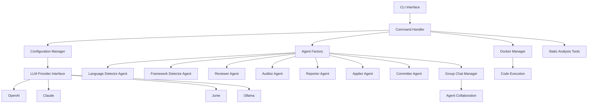

# VaahAI Technical Architecture

## System Overview

VaahAI is a multi-agent AI CLI tool built with Microsoft's Autogen Framework. This document outlines the technical architecture, component interactions, and design decisions for the system.

## Architecture Diagram



## Core Components

### 1. CLI Interface

The CLI interface is built using Typer and InquirerPy, providing a user-friendly command-line experience with interactive prompts when needed.

**Key Features:**
- Command registration and routing
- Help documentation generation
- Interactive configuration prompts
- Progress indicators for long-running operations
- Rich terminal output formatting

### 2. Configuration Manager

The Configuration Manager handles all configuration aspects of VaahAI, using a layered approach with TOML files.

**Key Features:**
- Default configuration values
- Global user configuration (~/.vaahai/config.toml)
- Project-specific configuration (.vaahai/config.toml)
- Environment variable overrides
- Configuration validation and migration
- Secure API key storage

### 3. Agent Factory

The Agent Factory is responsible for creating and configuring Autogen agents based on the task requirements.

**Key Features:**
- Dynamic agent creation
- Agent configuration based on user settings
- Prompt template loading and customization
- Agent caching for performance
- Agent lifecycle management

### 4. Group Chat Manager

The Group Chat Manager orchestrates communication and collaboration between multiple agents.

**Key Features:**
- Agent conversation orchestration
- Message routing and filtering
- Conversation history management
- Task coordination between agents
- Result aggregation from multiple agents

### 5. LLM Provider Interface

The LLM Provider Interface abstracts interactions with different LLM services.

**Key Features:**
- Unified API for different LLM providers
- Request formatting and response parsing
- Error handling and retry logic
- Rate limiting and quota management
- Streaming response support

### 6. Docker Manager

The Docker Manager handles secure code execution in isolated containers.

**Key Features:**
- Container lifecycle management
- Volume mounting for code access
- Environment configuration
- Resource limitation
- Security isolation

### 7. Static Analysis Integration

Integration with static analysis tools to enhance AI-powered code review.

**Key Features:**
- Tool detection and execution
- Result parsing and normalization
- Integration with AI prompts
- Language-specific tool selection

## Agent Types

### Language Detector Agent

Identifies programming languages used in the codebase.

**Responsibilities:**
- Analyze file extensions and content
- Detect multiple languages in a project
- Provide language statistics
- Identify primary and secondary languages

### Framework Detector Agent

Identifies frameworks, libraries, and technologies used in the codebase.

**Responsibilities:**
- Analyze import statements and dependencies
- Detect configuration files
- Identify project structure patterns
- Determine technology stack

### Reviewer Agent

Performs code reviews focusing on quality, style, and best practices.

**Responsibilities:**
- Identify code quality issues
- Suggest improvements
- Check for best practices
- Provide actionable feedback

### Auditor Agent

Performs comprehensive code audits for security, compliance, and architecture.

**Responsibilities:**
- Identify security vulnerabilities
- Check compliance with standards
- Assess architectural patterns
- Evaluate performance concerns

### Reporter Agent

Formats and presents findings from reviews and audits.

**Responsibilities:**
- Generate formatted reports
- Prioritize findings
- Create visual representations
- Support multiple output formats

### Applier Agent

Applies suggested code changes safely.

**Responsibilities:**
- Parse change suggestions
- Create file backups
- Apply changes with user confirmation
- Handle conflicts and errors

### Committer Agent

Manages git commits for applied changes.

**Responsibilities:**
- Generate commit messages
- Stage changed files
- Create commits
- Handle branch management

## Data Flow

1. **Command Execution:**
   - User invokes a VaahAI command
   - Command handler parses arguments and options
   - Configuration is loaded and validated
   - Appropriate workflow is initiated

2. **Code Analysis:**
   - Language and framework detection
   - Static analysis tool execution (if applicable)
   - Code parsing and preparation
   - Context building for LLM prompts

3. **Agent Collaboration:**
   - Group chat initialization
   - Agent task assignment
   - Inter-agent communication
   - Result aggregation

4. **Result Presentation:**
   - Reporter agent formats results
   - Output is presented to the user
   - Optional: changes are applied with confirmation
   - Optional: changes are committed to git

## File Structure

```
/vaahai/
├── __init__.py
├── main.py                  # Entry point
├── config/
│   ├── __init__.py
│   ├── manager.py           # Configuration management
│   └── schema.py            # Configuration schema
├── commands/
│   ├── __init__.py
│   ├── base.py              # Base command class
│   ├── config_cmd.py        # Configuration command
│   ├── review_cmd.py        # Review command
│   ├── audit_cmd.py         # Audit command
│   └── ...                  # Other commands
├── agents/
│   ├── __init__.py
│   ├── base.py              # Base agent class
│   ├── factory.py           # Agent factory
│   ├── language_detector/   # Language detector agent
│   ├── framework_detector/  # Framework detector agent
│   ├── reviewer/            # Reviewer agent
│   ├── auditor/             # Auditor agent
│   ├── reporter/            # Reporter agent
│   ├── applier/             # Applier agent
│   └── committer/           # Committer agent
├── llm/
│   ├── __init__.py
│   ├── provider.py          # Provider interface
│   ├── openai.py            # OpenAI implementation
│   ├── claude.py            # Claude implementation
│   └── ...                  # Other providers
├── docker/
│   ├── __init__.py
│   ├── manager.py           # Docker management
│   └── containers.py        # Container definitions
├── utils/
│   ├── __init__.py
│   ├── file_utils.py        # File operations
│   ├── git_utils.py         # Git operations
│   └── ...                  # Other utilities
└── test/
    ├── __init__.py
    ├── unit/                # Unit tests
    └── e2e/                 # End-to-end tests
```

## Technology Stack

| Component | Technology | Justification |
|-----------|------------|---------------|
| Programming Language | Python 3.9+ | Wide adoption, rich ecosystem, good AI/ML support |
| CLI Framework | Typer with InquirerPy | Modern, type-based CLI with interactive capabilities |
| AI Framework | Microsoft Autogen | Powerful multi-agent orchestration capabilities |
| Configuration | TOML | Human-readable, structured, widely adopted |
| LLM Providers | OpenAI, Claude, Junie, Ollama | Diverse options for different needs and preferences |
| Container | Docker | Industry standard for isolated execution environments |
| Package Management | Poetry | Modern dependency management and packaging |
| Testing | Pytest | Comprehensive testing framework with good fixtures |

## Security Considerations

1. **API Key Management:**
   - Keys stored in system keyring or environment variables
   - No hardcoded secrets in configuration files
   - Optional encryption for stored credentials

2. **Code Execution:**
   - Isolated Docker containers for code execution
   - Resource limitations to prevent abuse
   - No execution of untrusted code without confirmation

3. **Data Privacy:**
   - Option for local LLM execution via Ollama
   - Transparency about what code is sent to external services
   - No unnecessary data transmission

## Performance Considerations

1. **Large Codebase Handling:**
   - Chunking of large files
   - Selective analysis based on changes
   - Caching of analysis results

2. **LLM Optimization:**
   - Prompt optimization for token efficiency
   - Batching of related requests
   - Streaming responses for faster feedback

3. **Parallel Processing:**
   - Concurrent agent execution where possible
   - Asynchronous operations for I/O-bound tasks
   - Progress indicators for long-running operations

## Extensibility Points

1. **Custom Agents:**
   - Plugin architecture for new agent types
   - Agent registration system

2. **Custom Commands:**
   - Command registration mechanism
   - Command hook system

3. **Custom Prompts:**
   - User-definable prompt templates
   - Prompt extension points

4. **Integration Points:**
   - CI/CD integration hooks
   - IDE integration capabilities
   - API mode for programmatic access

## Error Handling

1. **Graceful Degradation:**
   - Fallback mechanisms for unavailable services
   - Partial results when complete analysis is not possible

2. **User Feedback:**
   - Clear error messages with actionable information
   - Debugging mode for detailed error information

3. **Recovery Mechanisms:**
   - Automatic retry for transient failures
   - State preservation for interrupted operations

## Future Architectural Considerations

1. **Scalability:**
   - Distributed agent execution
   - Remote LLM server support
   - Caching server for shared results

2. **Integration:**
   - IDE plugin architecture
   - CI/CD system integration
   - Team collaboration features

3. **Advanced Features:**
   - Learning from user feedback
   - Custom rule definition
   - Project-specific optimization
